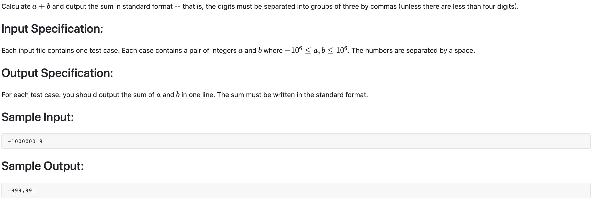

# 1001 A+B Format （20 分)



##题解

计算出结果转字符串，然后从后往前遍历，每三位添加一个逗号，注意开头不能添加逗号。

python:
```python
a = input().split(' ')
num1 = int(a[0])
num2 = int(a[1])
res = list(str(num1 + num2))
count = 0
resl = len(res)
if res[0] == '-':
    resl -= 1
for i in range(len(res) - 1, 0, -1):
    count += 1
    if count % 3 == 0 and count < resl:
        res.insert(i, ',')
for i in res:
    print(i, end='')
print()
```

c++:
```c++
#include <iostream>
#include <algorithm>
#include <string>
using namespace std;

string tmp;
string res;

int main() {
    int a, b;
    cin >> a >> b;
    int r = a+b;
    tmp = r > 0 ? to_string(r):to_string(-(r));
    int count = 0;
    for(int i = tmp.size(); i >= 0; --i) {
        res.push_back(tmp[i]);
        if(i == 0) {
            break;
        }
        if( count % 3 == 0 && count) {
            count = 0;
            res.push_back(',');
        }
        count ++;
    }
    reverse(res.begin(), res.end());
    if(r >= 0) {
        cout << res << endl;
    } else {
        cout << '-' << res << endl;
    }
    return 0;
}
```

