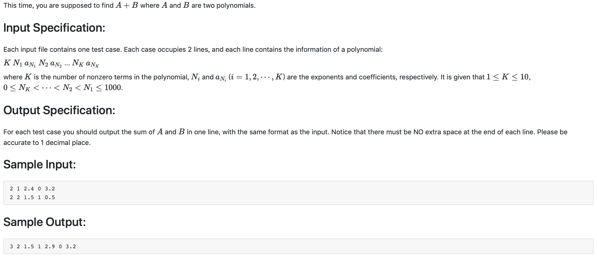

#1002 A+B for Polynomials （25 分)



题解：
用数组存放，数组索引作为指数，数组里面的值作为底数，第一次读取赋值，第二次读取相加，输出最后的结果即可。(注意保留一位小数)

```c++
#include <iostream>
#include<iomanip>
using namespace std;

float e[1010];

int main() {
    int K;
    for(int i = 0 ; i < 2; ++i) {
        int tempe;
        float tempco;
        cin >> K;
        for(int j = 0; j < K; ++j) {
            cin >> tempe >> tempco;
            e[tempe] += tempco;
        }
    }
    int count = 0;
    for(int i = 0; i <= 1000; ++i) {
        if(e[i] != 0) {
            count += 1;
        }
    }
    cout << count;
    for(int i = 1000; i >= 0; --i) {
        if(e[i] != 0) {
            cout << ' ' << i << ' ' << setiosflags(ios::fixed) << setprecision(1) << e[i];
        }
    }
}
```