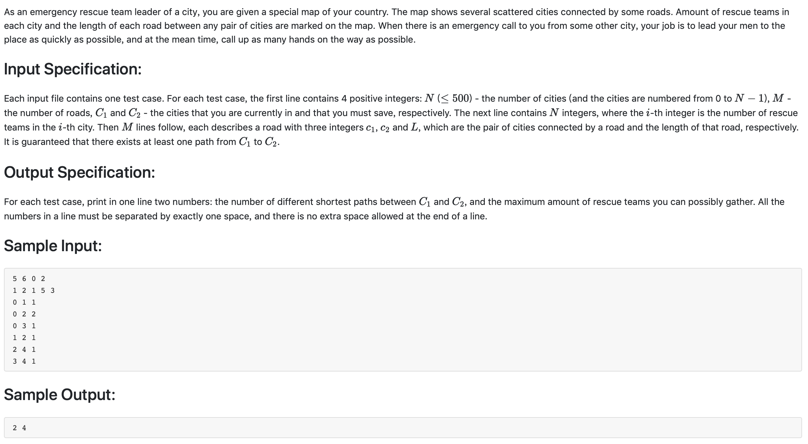

#1003 Emergency （25 分)


题解:变形的dijkstra算法，在计算的同时需要记录路径数和救援队数，在距离相等的情况下，选择救援队数多的那条路。注意更新路径数的规则，counts[n] 为到点n的路径数，若找到距离更小的路径di[i] + map[i][j] < di[j]，那么counts[j] = counts[i]；若距离相同，则counts[i] += counts[j]；

```c++
#include <iostream>
#include <climits>
#define MAX INT_MAX
using namespace std;

int map[501][501];
int citiesSaveTeams[501];
int cityNums, roadNums, startp, endp;
int visit[501];
int di[501];
int wi[501];
int counts[501];
void dij() {
    for(int i = 0; i < cityNums; ++i) {
        di[i] = MAX;
        wi[i] = citiesSaveTeams[i];
        visit[i] = 0;
    }
    di[startp] = 0;
    counts[startp] = 1;
    for(int i = 0; i < cityNums; ++i) {
        int n, minw = MAX;
        for(int j = 0; j < cityNums; ++j) {
            if(!visit[j] && di[j] < minw) {
                minw = di[j];
                n = j;
            }
        }
        visit[n] = 1;
        for(int j = 0; j < cityNums; ++j) {
            if(!visit[j] && map[n][j] < MAX ) {
                if(di[n] + map[n][j] < di[j]) {
                    wi[j] = wi[n] + citiesSaveTeams[j];
                    di[j] = di[n] + map[n][j];
                    counts[j] = counts[n];
                } else if (di[n] + map[n][j] == di[j] ) {
                    if(wi[j] < wi[n] + citiesSaveTeams[j])
                        wi[j] = wi[n] + citiesSaveTeams[j];
                    counts[j] = counts[n] + counts[j]; //路径数
                }
            }
        }
    }
    cout << counts[endp] << ' ' << wi[endp] << endl;

}

int main() {
    cin >> cityNums >> roadNums >> startp >> endp;
    for(int i = 0; i < cityNums; ++i) {
        for(int j = 0; j < cityNums; ++j) {
            if(i != j) {
                map[i][j] = MAX;
            }
        }
    }
    for(int i = 0; i < cityNums; ++i) {
        cin >> citiesSaveTeams[i];
    }
    int tempa, tempb, tempweight;
    for(int i = 0; i < roadNums; ++i) {
        cin >> tempa >> tempb >> tempweight;
        map[tempa][tempb] = tempweight;
        map[tempb][tempa] = tempweight;
    }

    dij();
}

```