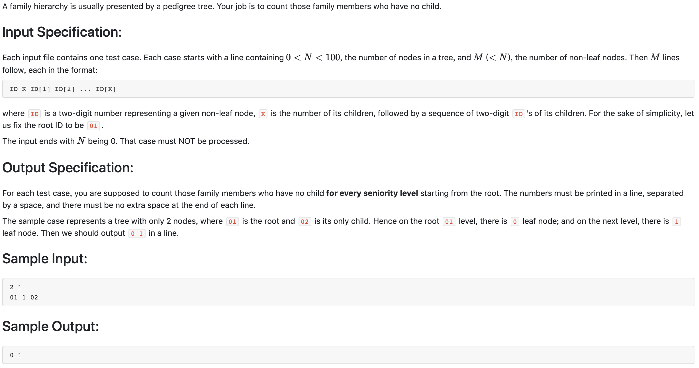

#1004 Counting Leaves （30 分)



题解:用一个数据结构存储该节点的孩子以及该节点的深度，然后再输入结束后，计算出所有节点的深度(从1开始)，接着只需要遍历所有节点，若该节点没有孩子，则该深度的叶子节点加一。

```c++
#include <iostream>
using namespace std;

typedef struct {
    int kids[101];
    int depth;
} FTree;

int N, M;
FTree family[101];
int depth[101];

void find() {
    int maxdep = 0;
    for(int i = 1; i <= 100; ++i) {
        bool hasKid = false;
        if(maxdep < family[i].depth) {
            maxdep = family[i].depth;
        }
        for(int j = 1; j <= 100; ++j) {
            if(family[i].kids[j]) {
                hasKid = true;
                break;
            }
        }
        if(!hasKid) {
            depth[family[i].depth] += 1;
        }
    }
    // cout << maxdep << endl;
    for(int i = 1; i < maxdep; ++i) {
        cout << depth[i] << ' ';
    }
    cout << depth[maxdep] << endl;
}

int main() {
    
    cin >> N >> M;
    family[1].depth = 1;
    for(int i = 0; i < M; ++i) {
        int ID, K;
        cin >> ID >> K;
        for(int j = 0; j < K; ++j) {
            int IDk;
            cin >> IDk;
            // cout << ID << ' ' << IDk << endl;
            family[ID].kids[IDk] = 1;
            // family[IDk].depth = family[ID].depth + 1;
        }
    }
    for(int i = 1; i <= N; ++i) {
        for(int j = 1; j <= N; ++j) {
            if(family[i].kids[j]) {
                family[j].depth = family[i].depth + 1;
            }
        }
    }
    find();
}
```