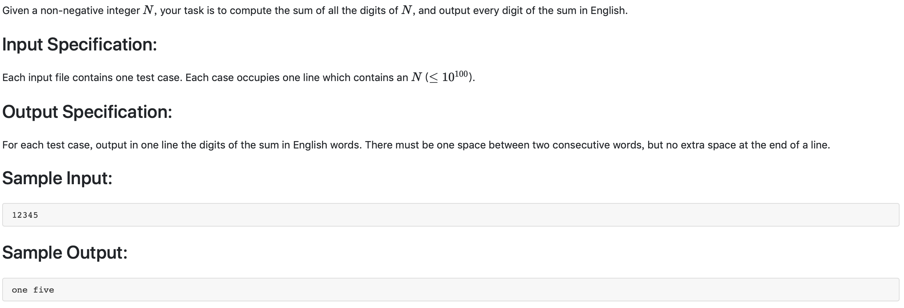

#1005 Spell It Right （20 分)


题解:简单的写法是使用递归，从第一位开始转换。或者转成字符串，从前往后转换。

```c++
#include <iostream>
#include <string>
using namespace std;
string number;

char outputAscii[10][10] = {"zero", "one", "two", "three", "four", "five", "six", "seven", "eight", "nine"};


void output(int num, int flag) {
    if(num != 0) {
        output(num/10, 0);
        int tmp = num % 10;
        if (flag) {
            cout << outputAscii[tmp];
        } else {
            cout << outputAscii[tmp] << ' ';
        }
        return ;
    } else {
        return ;
    }
}

int main() {
    cin >> number;
    int sum = 0;
    for(int i = 0; i < number.size(); ++i) {
        sum += number[i] - '0';
    }
    if (sum == 0) {
        cout << "zero" << endl;
    } else {
        output(sum, 1);
    }
}

```

python
```python
di = {'1':'one', '2':'two', '3':'three', '4':'four', '5':'five', '6':'six', '7':'seven', '8':'eight', '9':'nine', '0':'zero'}
res = list(str(sum([int(i)  for i in list(input())])))
print(di[res[0]], end='')
for i in res[1:]:
    print(' ' + di[i], end='')
```