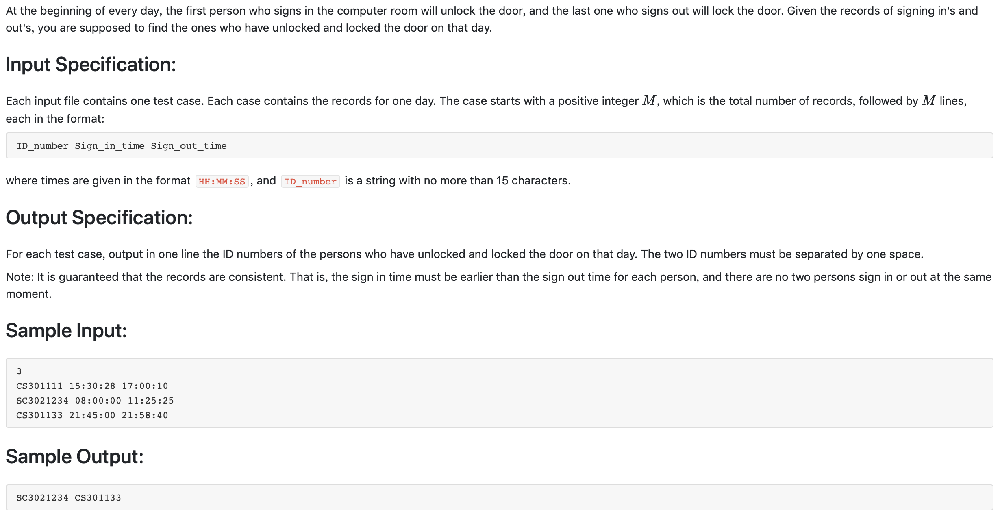

#1006 Sign In and Sign Out （25 分)



题解:排序即可，利用sort函数。

python
```python
def takeSecond(elem):
    return elem[1]
def takeThird(elem):
    return elem[2]

K = int(input())
total = []
for i in range(K):
    templ = input().split()
    total.append(templ)

total.sort(key=takeSecond)
print(total[0][0], end=' ')
total.sort(key=takeThird)
print(total[-1][0])
```

c++
```c++
#include <iostream>
#include <string>
#include <vector>
#include <algorithm>
using namespace std;
typedef struct table {
    string num;
    string st;
    string et;
} table;

vector <table> v;
int cmp1(table a, table b) {
    return a.st < b.st;
}
int cmp2(table a, table b) {
    return a.et > b.et;
}
int n;
int main() {
    cin >> n;

    for(int i = 0; i < n; ++i) {
        table tmp;
        cin >> tmp.num >> tmp.st >> tmp.et;
        v.push_back(tmp);
    }
    sort(v.begin(), v.end(), cmp1);
    cout << v[0].num << ' ';
    sort(v.begin(), v.end(), cmp2);
    cout << v[0].num << endl;
}
```