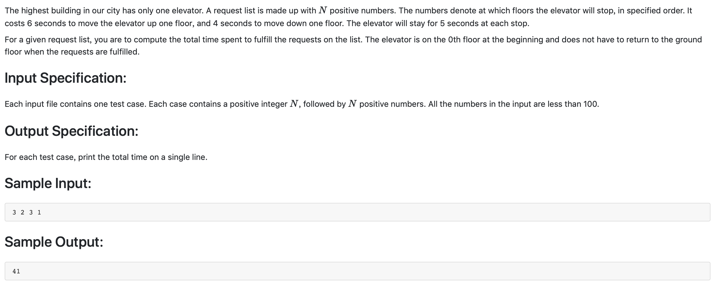

#1007 Maximum Subsequence Sum （25 分)



题解:动态规划，最大子串。


```c++
#include <iostream>
using namespace std;

int num[10001];
int numSum[10002];
int K;

int main() {
    cin >> K;
    numSum[0] = 0;
    for(int i = 1; i <= K; ++i) {
        cin >> numSum[i];
        num[i] = numSum[i];
        numSum[i] += numSum[i - 1];
    }    
    int besti, bestj, bestval = -1000000;
    for(int i = 0; i < K; ++i) {
        for(int j = i + 1; j <= K; ++j) {
            if (numSum[j] - numSum[i] > bestval) {
                bestval = numSum[j] - numSum[i];
                besti = num[i + 1];
                bestj = num[j];
            }
        }
    }
    if (bestval < 0) {
        cout << 0 << ' ' << num[1] << ' ' << num[K] << endl;
    } else {
        cout << bestval << ' ' << besti << ' ' << bestj << endl;
    }

}
```