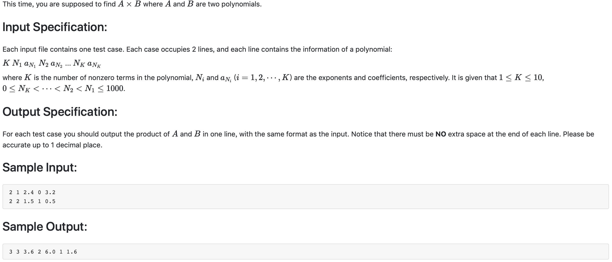

# 1009 Product of Polynomials （25 分)



题解:这次做乘法，先记录第一组数组，然后由一个结果数组存放结果，第二次每次输入一个指数和一个底数就和第一次记录的数组做运算(指数加，底数乘)放入结果数组。

```c++
#include <iostream>
#include <iomanip>
using namespace std;

float po[2020];
int tempe[10];
float tempco[10];

int main() {
    int K1;
    cin >> K1;
    int e;
    float cof;
    for(int i = 0; i < K1; ++i) {
        cin >> e >> cof;
        tempe[i] = e;
        tempco[i] = cof;
    }
    int K2;
    cin >> K2;
    for(int i = 0; i < K2; ++i) {
        cin >> e >> cof;
        for(int j = 0; j < K1; ++j) {
            int res_e = tempe[j] + e;
            float res_co = tempco[j]*cof;
            po[res_e] += res_co;
        }
    }
    int count = 0;
    for(int i = 0; i <= 2000; ++i) {
        if(po[i] != 0) {
            count += 1;
        }
    }
    cout << count;
    for(int i = 2000; i >= 0; --i) {
        if(po[i] != 0){
            cout << ' ' << i << ' ' << setiosflags(ios::fixed) << setprecision(1) << po[i];
        }
    }

}
```