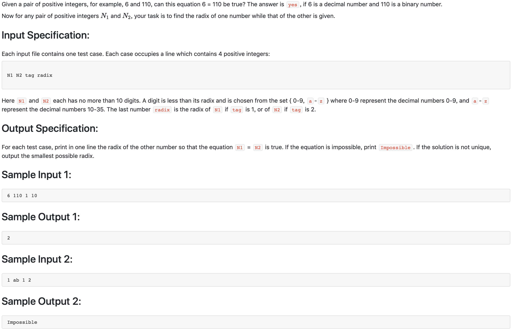

# 1010 Radix （25 分)



题解:这道题容易忽略的是进制可能大于36。如果只是使用了遍历搜索，那么会卡时，只能通过二分搜索，二分搜索的边界得确定好，最小值肯定不能低于某个进制，例如该数为129，那么最低要10进制，否则不可能出现9，最大值可以是他本身，然后二分搜索。

```c++

// radix can larger than 36
#include <iostream>
#include <string>
#include <math.h>
using namespace std;
long long int num2Dec(string s, int radix_);
string num1, num2;
string procNum;
string nonProcNum;
int tag, radix;

long long int numDec;

void binSearch() {
    string::iterator ite;
    ite = procNum.begin();
    char maxch = 0;
    for(int i = 0; i < procNum.size(); ++i) {
        if(*ite > maxch) {
            maxch = *ite;
        }
        ite++;
    }
    int minradix = 1;
    if('0' < maxch && maxch <= '9') {
        minradix = maxch - '0' + 1;
    } else if (maxch >= 'a'){
        minradix = maxch - 'a' + 11;
    }
    int i = 0;
    int find = 0;
    long long int low = minradix;
    long long int high = max(low, numDec);
    long long int mid;
    while(low <= high) {
        mid = (low + high)/2;
        long long int tmp = num2Dec(procNum, mid);
        if (tmp < numDec && tmp >= 0) {
            low = mid + 1;
        } else if (tmp > numDec || tmp < 0 ) {
            high = mid - 1;
        } else if (tmp == numDec) {
            cout << mid << endl;
            find = 1;
            break;
        }
    }
    if(!find) {
        cout << "Impossible" << endl;
    }
}

long long int num2Dec(string s, int radix_) {
    string::iterator ite;
    ite = s.begin();
    long long int res = 0;
    for(int i = s.size() - 1; i >= 0; --i) {
        int tmpnum = *ite >= 'a' ? *ite - 'a' + 10 : *ite - '0';
        res += (tmpnum)*pow(radix_, i);
        ite++;
    }
    return res;
}

int main() {
    cin >> num1 >> num2 >> tag >> radix;
    if (tag == 1) {
        procNum = num2;
        nonProcNum = num1;
    } else {
        procNum = num1;
        nonProcNum = num2;
    }
    numDec = num2Dec(nonProcNum, radix);
    // cout << numDec << endl;
    binSearch();
}
```