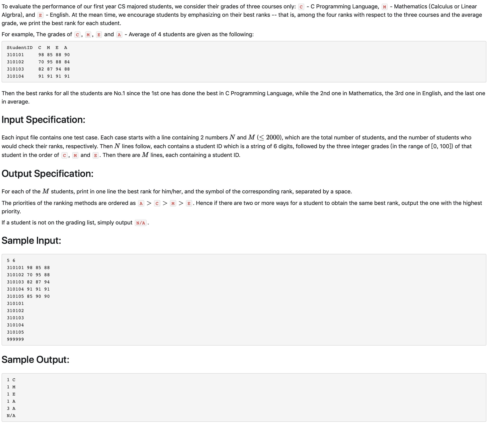

# 1012 The Best Rank （25 分)



题解：以空间换时间，直接开辟4个101大小的空间存放0-100分的学号，有的话直接添加进去，然后获取排名的时候遍历一遍即可。

python:

```python
NM = input().split()
AL = [[] for i in range(101)]
CL = [[] for i in range(101)]
ML = [[] for i in range(101)]
EL = [[] for i in range(101)]
nameL = []
def pList(L):
    for n,i in enumerate(L):
        if i:
            print(n, i)

def getRank(L, number):
    rank = 0
    for i in range(100, 0, -1):
        rank += 1
        if L[i] and number in L[i]:
            return rank
        else:
            rank -= 1
            rank += len(L[i])


for i in range(int(NM[0])):
    tmp = input().split(" ")
    Cgrad = int(tmp[1])
    Mgrad = int(tmp[2])
    Egrad = int(tmp[3])
    ID = tmp[0]
    nameL.append(ID)
    CL[Cgrad].append(ID)
    ML[Mgrad].append(ID)
    EL[Egrad].append(ID)
    average = round((Cgrad + Mgrad + Egrad)/3)
    AL[average].append(ID)
# print(AL, CL, ML, EL)
# pList(AL)
for i in range(int(NM[1])):
    ID = input()
    if ID in nameL:
        rankA = getRank(AL, ID)
        rankC = getRank(CL, ID)
        rankM = getRank(ML, ID)
        rankE = getRank(EL, ID)
        # print(rankA, rankC, rankM, rankE)
        if rankA <= rankC and rankA <= rankE and rankA <= rankM:
            print(rankA, 'A')
        elif rankC <= rankE and rankC <= rankM:
            print(rankC, 'C')
        elif rankM <= rankE:
            print(rankM, 'M')
        else:
            print(rankE, 'E')
    else:
        print('N/A')
```

