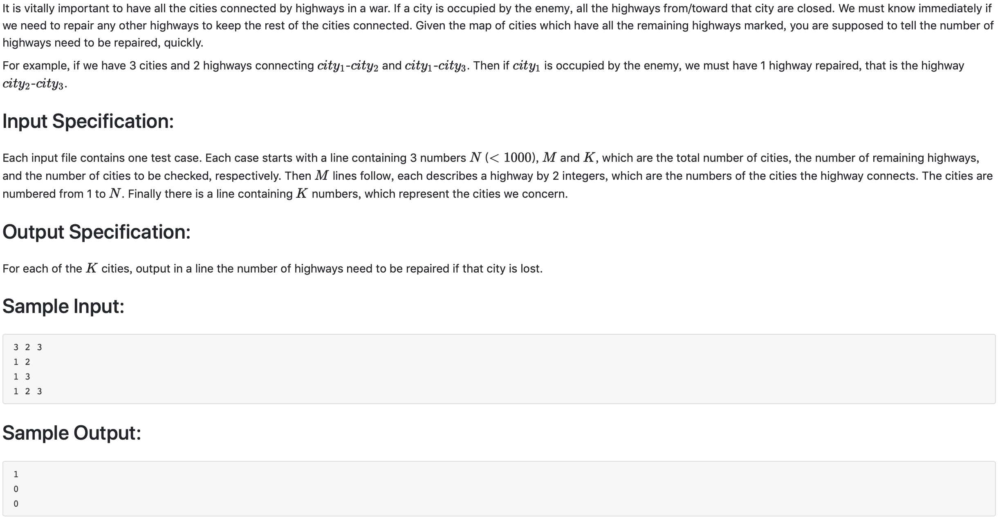

# 1013 Battle Over Cities （25 分)



题解：判断有多少个连通分量，一个的话就不用修，n个(n >= 2)的话就需要修n - 1条路。
用深度优先搜索即可找到有几个连通分量。

```c++
#include <iostream>
using namespace std;


int map[1001][1001];
int searched[1001];
int cityNums, roadNums, testNum;

void dfs(int start, int bk) {
    searched[start] = 1;
    for(int i = 1; i <= cityNums; ++i) {
        if(map[start][i] == 1 && ! searched[i]) {
            dfs(i, bk);
        }
    }
}


int dfsSearch(int bk) {
    int count = 0;
    for(int i = 1; i <= cityNums; ++i) {
        if(!searched[i]) {
            count += 1;
            dfs(i, bk);
        }
    }
    return count;
}

int main() {
    cin >> cityNums >> roadNums >> testNum;
    for(int i = 0; i < roadNums; ++i) {
        int c1, c2;
        scanf("%d %d", &c1, &c2);
        map[c1][c2] = 1;
        map[c2][c1] = 1;
    }
    for(int i = 0; i < testNum; ++i) {
        int temp;
        scanf("%d", &temp);
        
        for(int i = 1; i <= cityNums; ++i) {
            searched[i] = 0;
        }
        searched[temp] = 1;
        cout << dfsSearch(temp) - 1 << endl;
    }
}
```