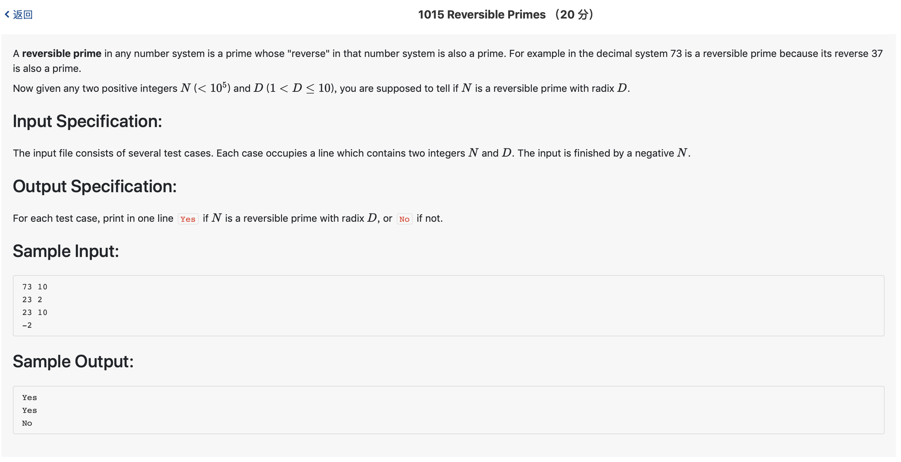

# 1015 Reversible Primes （20 分)



题解: 先转成对应进制的的数，然后判断是否是回文数即可。然后判断原数是否是素数。

```c++

#include <iostream>
#include <string>
#include <math.h>
#include <algorithm>

using namespace std;
//注意1，否则有一个测试的过不去

string ToRadixNum(int num, int radix) {
    // cout << num << endl;
    string s("");
    if(num/radix != 0) {
        // cout << num;
        s = ToRadixNum(num/radix, radix);
        char tmp = num % radix + '0';
        s.insert(s.size(), 1, tmp);
        return s;
    } else {
        s = s + (char)(num % radix + '0');
        return s;
    }
}

int ToDec(string s, int radix) {
    int res = 0;
    string::iterator  ite;
    ite = s.begin();
    for(int i = s.size() - 1; i >= 0; --i) {
        res += (*ite - '0') * pow(radix, i);
        ite++;
    }
    return res;
}

bool isPrime(int num) {
    if(num <= 1) {
        return false;
    }
    if(num == 2 || num == 3) {
        return true;
    }
    for(int i = 2 ; i < sqrt(num) + 1; ++i) {
        if(num % i == 0) {
            return false;
        }
    }
    return true;
}

int main() {
    int s;
    int radix;
    while(1){
        cin >> s;
        if(s < 0) {
            break;
        }
        cin >> radix;
        string tmps = ToRadixNum(s, radix);
        string tmps_v = ToRadixNum(s, radix);
        reverse(tmps_v.begin(), tmps_v.end());
        int a = ToDec(tmps, radix);
        if(!isPrime(a)) {
            cout << "No" << endl;
            continue;
        }
        int b = ToDec(tmps_v, radix);
        if(!isPrime(b)) {
            cout << "No" << endl;
            continue;
        } else {
            cout << "Yes" << endl;
        }
    }
    return 0;
}

```