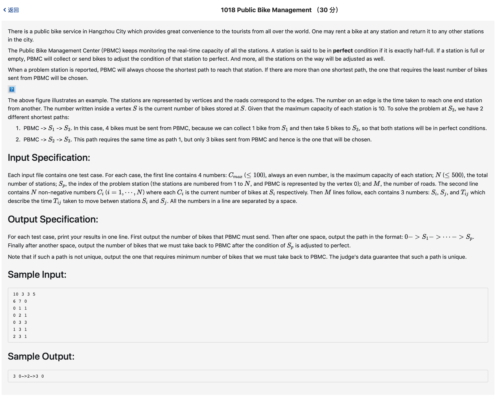

# 1018 Public Bike Management （30 分)



题解: 这题不能用dijkstra算法，因为不满足最优子结构性质。使用深度优先搜索即可，维护一个发出自行车数量的变量和回收的变量，需要预先处理好每个点 所需/回收 的数量，即
直接将读入的数据减去 max capacity / 2， 保证经过这个点时让这个点处于完美状态。


```c++
#include <iostream>
#include <math.h>
#include <vector>
#define INF 1000000
using namespace std;

vector<int> curpath;
vector<int> shortpath;
int map[505][505];
int weight[505];
int maxCapa, vexNum, targetVex, roadNum;
int bestsend, besttake, bestDis;
int cursend, curtake, curdis;
int visit[505];
int lastP[505];

void initData() {
    bestsend = INF;
    besttake = INF;
    bestDis = INF;
    cursend = 0;
    curtake = 0;
    curdis = 0;
    for(int i = 0; i <= vexNum; ++i) {
        visit[i] = 0;
        for(int j = 0; j <= vexNum; ++j) {
            if(i != j) {
                map[i][j] = INF;
            }
        }
    }
}

void dfs(int index, int dep) {
    if(index == targetVex) {
        if(curdis < bestDis) {
            bestDis = curdis;
            bestsend = cursend;
            besttake = curtake;
            shortpath = curpath;
        } else if (curdis == bestDis && (cursend < bestsend || (cursend == bestsend && curtake < besttake))){
            bestsend = cursend;
            besttake = curtake;
            shortpath = curpath;
        }
        return ;
    }
    for(int i = 1; i <= vexNum; ++i) {
        if(!visit[i] &&  curdis + map[index][i] <= bestDis) {
            visit[i] = 1;
            int tmps = cursend, tmpt = curtake;
            //关键在这
            if(curtake + weight[i] < 0) {
                cursend += -(curtake + weight[i]);
                curtake = 0;
            } else {
                curtake += weight[i];
            }
            curdis += map[index][i];
            curpath.push_back(i);
            dfs(i, dep + 1);
            curpath.pop_back();
            curdis -= map[index][i];
            cursend = tmps;
            curtake = tmpt;
            visit[i] = 0;
        }
    }
}


void printRes() {
    cout << bestsend << ' ';
    cout << '0';
    for(int i = 0; i < shortpath.size(); ++i) {
        cout << "->" << shortpath[i];
    }
    cout << ' ';
    cout << besttake << endl;
}


int main() {
    cin >> maxCapa >> vexNum >> targetVex >> roadNum;
    for(int i = 1; i <= vexNum; ++i) {
        cin >> weight[i];
        weight[i] -= maxCapa/2;
    }
    
    initData();
    for(int i = 0; i < roadNum; ++i) {
        int a, b, w;
        cin >> a >> b >> w;
        map[a][b] = w;
        map[b][a] = w;
    }
    
    dfs(0, 0);
    printRes();
}
```