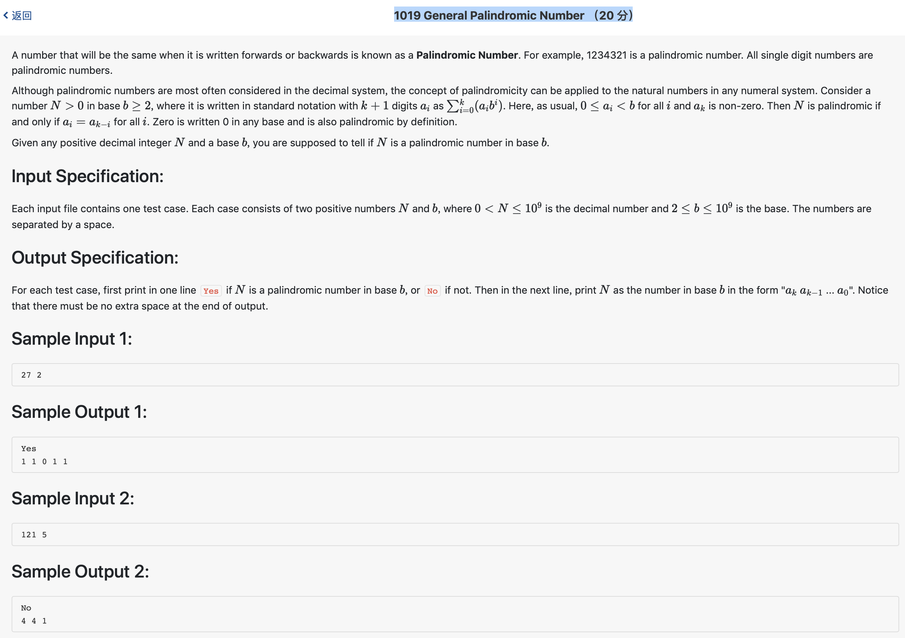

# 1019 General Palindromic Number （20 分)



题解: 进制转换加回文数判断，可以用reverse，也可以直接循环判断。

```c++

#include <iostream>
#include <string>
#include <vector>
#include <algorithm>
using namespace std;

vector <int> L;

long long int n, m;


int main() {
    cin >> n >> m;
    while(n) {
        L.push_back(n % m);
        n /= m;
    }
    int flag = 1;
    for(int i = 0; i < L.size()/2; ++i) {
        if(L[i] != L[L.size() - 1 - i]) {
            flag = 0;
            break;
        }
    }
    if(flag) {
        cout << "Yes" << endl;
    } else  {
        cout << "No" << endl;
    }
    if(!L.size()) {
        cout << '0' << endl;
    } else {
        cout << L[L.size() - 1];
        for(int i = L.size() - 2; i >= 0; --i) {
            cout << ' ' << L[i];
        }
        cout << endl;
    }
    return 0;
}
```