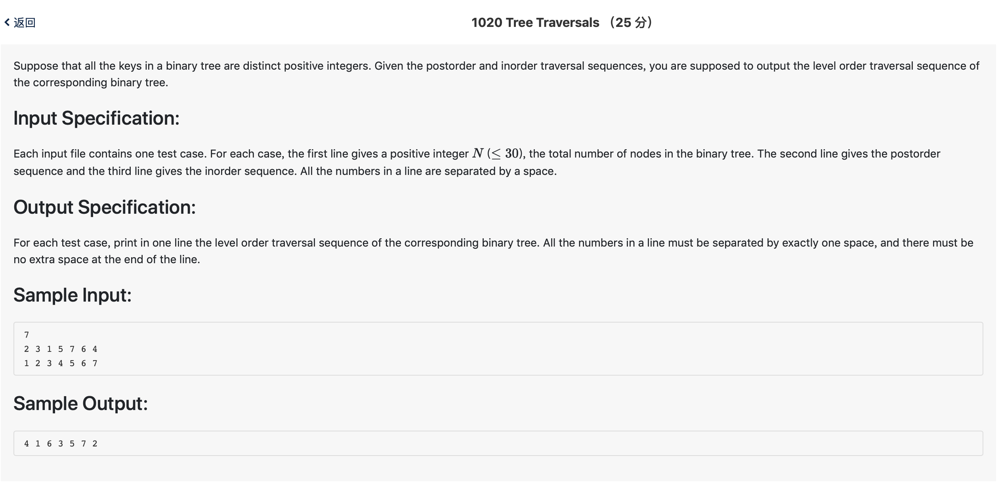

# 1020 Tree Traversals （25 分)



题解: 给后序遍历和中序遍历，输出层次遍历。通过先序遍历，存放每个深度的点即可，先序遍历中，相同深度的点的先后顺序是满足层次遍历的顺序的。


```c++
#include <iostream>
#include <string>
#include <vector>
using namespace std;

typedef struct Tree {
    int node;
    int left;
    int right;
    int depth;
}Tree;

vector <int> post, in;
int n;
vector <int> level[100];
void find(int left, int right, int depth) {
    if(left == right) {
        level[depth].push_back(in[left]);
        return ;
    }
    int maxt = 0, mnode;
    int divide;
    for(int i = left; i <= right; ++i) {
        int tmp = in[i];
        for(int j = 0; j < post.size(); ++j) {
            if(post[j] == tmp && j > maxt) {
                mnode = tmp;
                maxt = j;
                divide = i;
            }
        }
    }
    int newleft1 = left, newright1, newleft2, newright2 = right;
    newright1 = max(left, divide - 1);
    newleft2 = min(right, divide + 1);
    level[depth].push_back(in[divide]);
    if(divide != left)
        find(newleft1, newright1, depth + 1);
    if(divide != right)
        find(newleft2, newright2, depth + 1);
}

int main() {
    cin >> n ;
    for(int i = 0; i < n; ++i) {
        int tmp;
        cin >> tmp;
        post.push_back(tmp);
    }
    for(int i = 0; i < n; ++i) {
        int tmp;
        cin >> tmp;
        in.push_back(tmp);
    }
    find(0, in.size() - 1, 1);
    for(int i = 1; !level[i].empty(); ++i) {
        if(i == 1)
            cout << level[i][0];
        else
            cout << ' ' << level[i][0];
        for(int k = 1; k < level[i].size(); ++k) {
            cout <<  ' ' << level[i][k];
        }
    }
    cout << endl;
}
```