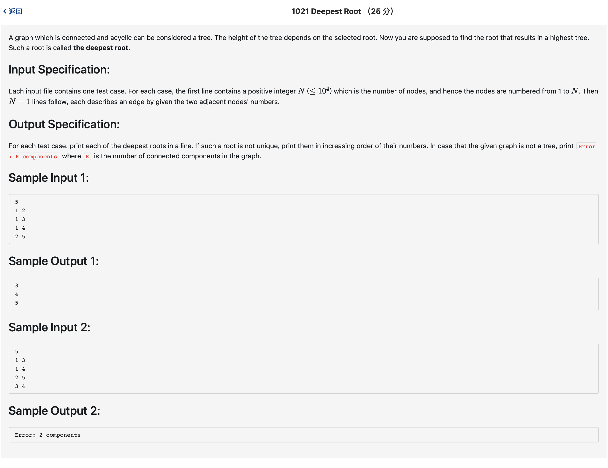

# 1021 Deepest Root （25 分)




题解: 判断一下，若连通分量大于1，直接ERROR，否则从任意一点开始，深度搜索找到最深的点，然后再从最深的点再次深度搜索，找到最深的其他点，这样就能找出所有的点。为什么要两次？因为第一次找到的并不一定是最深的，有可能存在其他点比这个任意选取的点深度更深。为什么要选第一次dfs找到的最深的点开始，因为如果不从该点开始，第二次找到的点就不可能是最深的。


```c++
#include <iostream>
#include <vector>
using namespace std;

//判断是否连通，如果连通则一定是树，然后任意找一个点dfs，获取最深的点，然后再从那个点做一次dfs，保存下每个结点的深度，然后就是结果。

vector <int> map[10002]; //结点链表
int maxNodeNum;
int visit[10002];
int maxdepth = 0;
int maxi = 0;
int height[10002];
void dfs(int node, int depth) {
    if(!visit[node]) {
        visit[node] = 1;
        if (height[node] < depth) {
            height[node] = depth;
        }
        if(maxdepth < depth) {
            maxi = node;
            maxdepth = depth;
        }
        vector <int>::iterator ite;
        ite = map[node].begin();
        for(;ite != map[node].end(); ++ite) {
            dfs(*ite, depth + 1);
        }
    }

}

void dfsSearch() {
    int compo = 0;
    for(int i = 1; i <= maxNodeNum; ++i) {
        if(!visit[i]) {
            compo ++;
            dfs(i, 1);
        }
    }
    if(compo > 1) {
        printf("Error: %d components\n", compo);
    } else {
        // cout << "t" << maxi << ' ' << maxdepth << endl;
        int temp = maxi;
        for(int i = 1; i <= maxNodeNum; ++i) {
            visit[i] = 0;
        }
        dfs(temp, 1);
        // for(int i = 1; i <= maxNodeNum; ++i) {
        //     cout << height[i] << ' ';
        // }
        // cout << endl;
        int next = 0;
        for(int i = 1; i <= maxNodeNum; ++i) {
            if(height[i] == maxdepth) {
                next = i;
                break;
                // printf("%d\n", i);
            }
        }
        for(int i = 1; i <= maxNodeNum; ++i) {
            visit[i] = 0;
        }
        dfs(next, 1);
        for(int i = 1; i <= maxNodeNum; ++i) {
            if(height[i] == maxdepth) {
                // next = i;
                printf("%d\n", i);
            }
        }
    }
    // putchar('\n');

}

int main() {
    scanf("%d", &maxNodeNum);
    for(int i = 0; i < maxNodeNum - 1; ++i) {
        int a, b;
        cin >> a >> b;
        map[a].push_back(b);
        map[b].push_back(a);
    }
    dfsSearch();
}
```