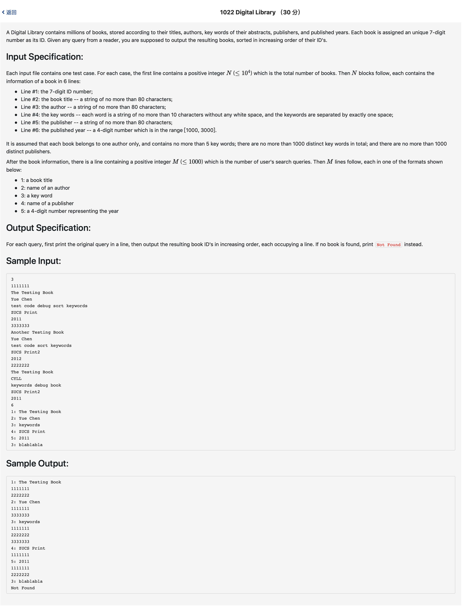

# 1022 Digital Library （30 分)



题解: 字符串处理，用map即可解决。


python:最后一个超时

```python
from collections import OrderedDict
n = int(input())
books = OrderedDict()
for i in range(n):
    id = input()
    books[id] = {}
    books[id]['1:'] = input()
    books[id]['2:'] = input()
    books[id]['3:'] = input()
    books[id]['4:'] = input()
    books[id]['5:'] = input()
m = int(input())
for i in range(m):
    tmp = input()
    idx = tmp.split()[0]
    other = " ".join(tmp.split()[1:])
    print(idx, other)
    reslist = []
    if idx == '3:':
        for k in books:
            if other in books[k][idx]:
                reslist.append(k)
    else:
        for k in books:
            if other == books[k][idx]:
                reslist.append(k)
    if not reslist:
        print('Not Found')
    else:
        reslist.sort()
        for k in reslist:
            print(k)

```

c++:

```c++
#include <iostream>
#include <map>
#include <string>
#include <algorithm>
#include <vector>
using namespace std;

typedef struct info {
    string infomation[5];
} info;

map <string, info> m;
int n, testnum;
vector <string> res;

bool cmp(string a, string b) {
    return a < b;
}

int main() {
    cin >> n;
    getchar();
    for(int i = 0; i < n; ++i) {
        string num;
        char c;
        while((c = getchar()) != '\n') {
            num += c;
        }
        // printf("tstpoint1\n");
        info in;
        for(int j = 0; j < 5; ++j) {
            string tmp;
            char c;
            while((c = getchar()) != '\n') {
                tmp += c;
            }
            in.infomation[j] = tmp;
        }
        m.insert(make_pair(num, in));
    }
    cin >> testnum;
    getchar();
    for(int i = 0; i < testnum; ++i) {
        string num;
        res.clear();
        cin >> num;
        int idx = num[0] - '0' - 1;
        // cout << idx << endl;
        string tmp;
        char c;
        while((c = getchar()) != '\n') {
            tmp += c;
        }
        tmp.erase(0, 1);
        printf("%s %s\n", num.data(), tmp.data());
        map <string, info> :: iterator it;
        it = m.begin();
        while(it != m.end()) {
            if(idx != 2 && it->second.infomation[idx] == tmp)  {
                res.push_back(it->first);
            } else if(idx == 2 && it->second.infomation[idx].find(tmp, 0) <= it->second.infomation[idx].length()) {
                // printf("%lu\n", it->second.infomation[idx].find(tmp));
                res.push_back(it->first);
            }
            it++;
        }
        if(res.empty()) {
            printf("Not Found\n");
        } else {
            sort(res.begin(), res.end(), cmp);
            for(int k = 0; k < res.size(); ++k) {
                printf("%s\n", res[k].data());
            }
        }
    }
}
```