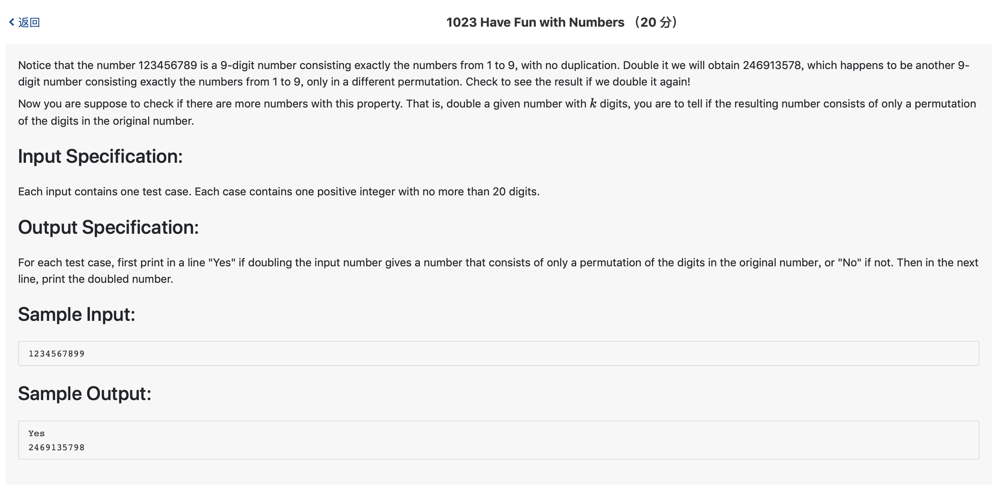

# 1023 Have Fun with Numbers （20 分)



题解: "大数"乘2，判断数字个数，有三种情况:

1. 数位相同，数字不同，错
2. 数位相同，数字相同，对
3. 数位不同，错

```c++
#include <iostream>
#include <string>
using namespace std;


string s;
string tmp = "0000000000000000000000";
int digits;
bool judge() {
    
    int k = 0;
    int last = 0;
    for(int i = s.size() - 1; i >= 0; --i) {
        int t = s[i] - '0';
        t *= 2;
        if (t +  last > 9) {
            tmp[i] = (t +  last) % 10 + '0';
            last = 1;
        } else {
            tmp[i] = (t +  last) + '0';
            last = 0;
        }
    }
    if (last == 1) {
        tmp.insert(0, 1, '1');
        digits += 1;
        return false;
    }
    int flag1 [10] = {0};
    int flag2 [10] = {0};
    for(int i = 0; i < s.size(); ++i) {
        flag1[s[i] - '0'] += 1;
        flag2[tmp[i] - '0'] += 1;
    }
    int flag = 1;
    for(int i = 0; i <10; ++i) {
        if(flag1[i] != flag2[i]) {
            flag = 0;
            break;
        }
    }
    return flag;
}

int main() {
    cin >> s;
    digits = s.size();
    if(judge()) {
        cout << "Yes" << endl;
    } else {
        cout << "No" << endl;
    }
    cout << tmp.substr(0, digits);
}
```