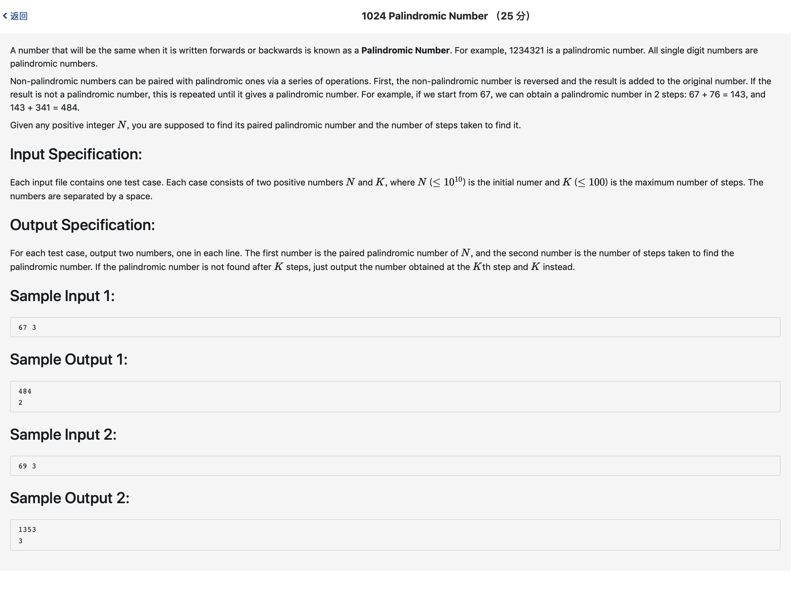

# 1024 Palindromic Number （25 分)



题解: reverse加上加法运算。判断几部后是回文数，步数限制为K。

python:

```python
l = input().split()

num = l[0]
k = 0
for i in range(int(l[1])):
    num_rev = num
    temp = list(num)
    temp.reverse()
    num_rev = "".join(temp)
    if num == num_rev:
        break
    num = str(int(num) + int(num_rev))
    k += 1
print(num)
print(k)
```

c++:

```c++
#include <iostream>
#include <algorithm>
using namespace std;


string add(string a, string b ) {
    int d = 0;
    int last = 0;
    string res;
    for(int i = a.size() - 1; i >= 0; --i) {
        char c = ( last + a[i] - '0' + b[i] - '0') % 10 + '0';
        last = ( last + a[i] - '0' + b[i] - '0') / 10;
        res.insert(0, 1, c);
    }
    if(last) {
        res.insert(0, 1, '1');
    }
    return res;
}

int main() {
    string s;
    int K, i;
    cin >> s >> K;
    for(i = 0; i < K; ++i) {
        string t = s.data();
        reverse(t.begin(), t.end());
        if(s == t) {
            break;
        }
        s = add(s, t);
    }
    cout << s << endl << i << endl;
}
```