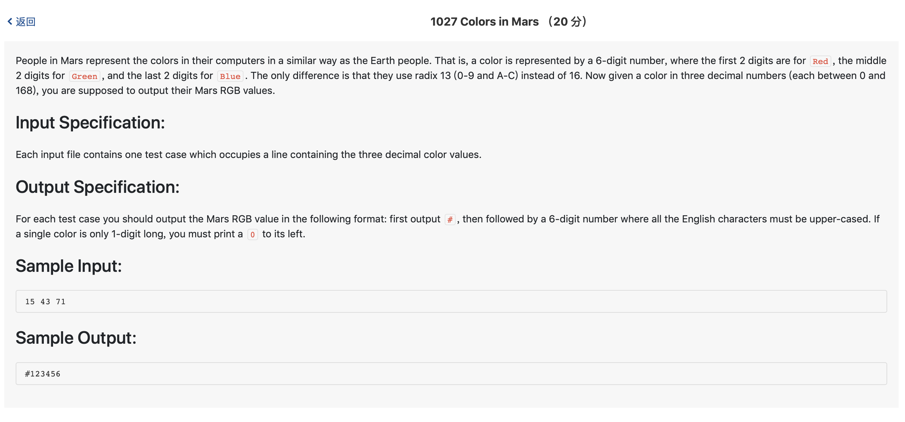

# 1027 Colors in Mars （20 分)



题解: 简单进制转换，注意0X的情况，记得补0成两位数。

```c++
//十进制转13进制

#include <iostream>
using namespace std;

void decTo13(int num) {
    if(num/13 != 0) {
        decTo13(num/13);
        char c = num % 13 >= 10? 'A' + num % 13 - 10: '0' + num % 13;
        cout << c;
    } else {
        char c = num % 13 >= 10? 'A' + num % 13 - 10: '0' + num % 13;
        cout << c;
        return;
    }
}

void change(int red, int green, int blue) {
    cout << '#';
    if (red < 13) {
        char c = red % 13 >= 10? 'A' + red % 13 - 10: '0' + red % 13;
        cout << '0' << c;
    } else {
        decTo13(red);
    }
    if (green < 13) {
        char c = green % 13 >= 10? 'A' + green % 13 - 10: '0' + green % 13;
        cout << '0' << c;
    } else {
        decTo13(green);
    }
    if (blue < 13) {
        char c = blue % 13 >= 10? 'A' + blue % 13 - 10: '0' + blue % 13;
        cout << '0' << c;
    } else {
        decTo13(blue);
    }

}

int main() {
    int red;
    int blue;
    int green;
    cin >> red >> green >> blue;
    change(red, green, blue);
}
```