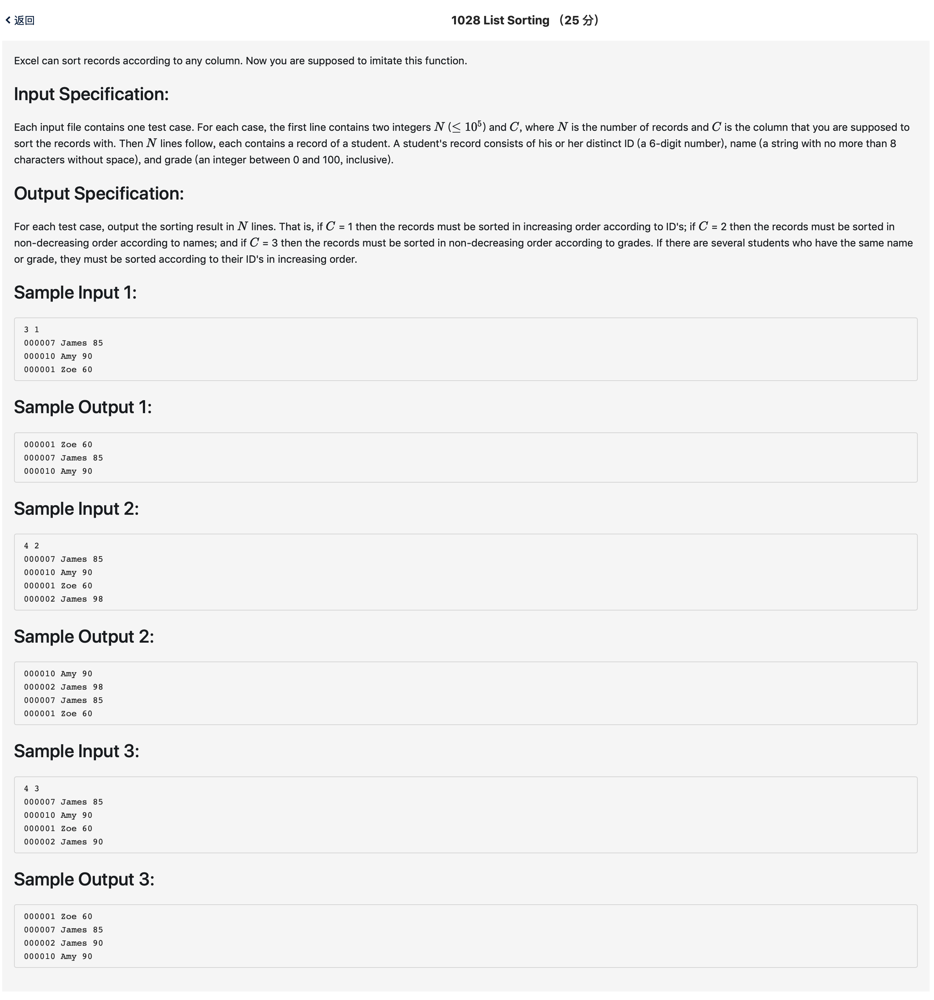

# 1028 List Sorting （25 分)



题解: 简单字符串处理加多条件排序，写好数据结构和cmp函数即可。

python: 

```python
# split 会导致速度慢很多，尽量不要用，直接处理字符串
NC = input().split()
total = []
for i in range(int(NC[0])):
    total.append(input())
# print(total)
def printtotal():
    for i in total:
        print(i)
if NC[1] == '1':
    total.sort(key=lambda x:x)
    printtotal()
elif NC[1] == '2':
    total.sort(key=lambda x:(x[7:-3], int(x[:6])))
    printtotal()
elif NC[1] == '3':
    total.sort(key=lambda x:(x[-2:], x[:6]))
    printtotal()
```

c++:

```c++
#include <iostream>
#include <string>
#include <vector>
#include <algorithm>
using namespace std;
typedef struct node {
    int score;
    string name;
    string id;
} node;

vector <node> v;

int n, m;

int cmp1(node a, node b) {
    return a.id < b.id;
}

int cmp2(node a, node b) {
    if(a.name != b.name) {
        return a.name < b.name;
    } else {
        return a.id < b.id;
    }
    
}

int cmp3(node a, node b) {
    if(a.score != b.score) {
        return a.score < b.score;
    } else {
        return a.id < b.id;
    }
}

int main() {
    scanf("%d %d", &n, &m);
    for(int i = 0; i < n; ++i) {
        char buf1[16];
        char buf2[16];
        int sc;
        scanf("%s %s %d", buf1, buf2, &sc);
        string name = buf2;
        string id = buf1;
        node tmp = {sc, name, id};
        v.push_back(tmp);
    }

    switch (m)
    {
        case 1: {
            sort(v.begin(), v.end(), cmp1);
        } break;
        case 2: {
            sort(v.begin(), v.end(), cmp2);
        } break;
        case 3: {
            sort(v.begin(), v.end(), cmp3);
        } break;
    }
    vector <node> :: iterator it = v.begin();
    while(it != v.end()) {
        printf("%s %s %d\n", it->id.data(), it->name.data(), it->score);
        it++;
    }
}
```