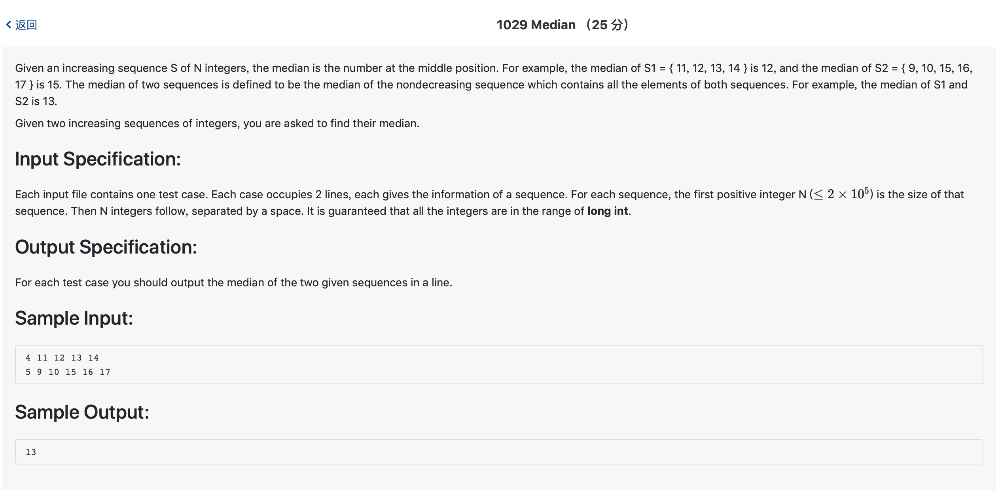

# 1029 Median （25 分)




题解: 维护两个队列还有一个计数变量记录出队列的数，如果该计数变量等于第一个队列先全部输入，在输入第二个队列的时候，如果输入的数比第一个队列第一个数小，则直接不进入队列；如果大于等于，则第一个队列的第一个元素丢弃，并将该数放入第二个队列。计数变量达到N/2(N为数字总数)时两个队列的第一个数中较小者就是中间数。如果没有达到N/2就输入完成，那么继续把非空队列按照之前规则出队直到计数变量达到N/2。

注意:题目虽然说不超过longint，实际上在中间的数不可能超过int，因此可以输入lld，然后强制转成INT_MAX在放入队列。记得在队列末尾插入一个INT_MAX，防止段错误。

```c++
#include <iostream>
#include <queue>
#include <climits>
#include <algorithm>
using namespace std;

queue <int> a, b;
int m, n;

int main() {
    cin >> m;
    for(int i = 0; i < m; ++i) {
        long long int tmp;
        scanf("%lld", &tmp);
        tmp = min((long long )INT_MAX, tmp);
        a.push(tmp);
    }
    a.push(INT_MAX);
    cin >> n;
    int cnt = 0;
    for(int i = 0; i < n; ++i) {
        long long int tmp;
        scanf("%lld", &tmp);
        tmp = min((long long )INT_MAX, tmp);
        b.push(tmp);
        if(cnt == (n + m - 1)/2) {
            cout << min(a.front(), b.front()) << endl;
            return 0;
        }
        if (a.front() < b.front()) {
            a.pop();
        } else {
            b.pop();
        }
        cnt ++;
    }
    b.push(INT_MAX);
    for(;cnt < (n + m - 1)/2;) {
        if (a.front() < b.front()) {
            a.pop();
        } else {
            b.pop();
        }
        cnt ++;
    }
    cout << min(a.front(), b.front()) << endl;
}
```