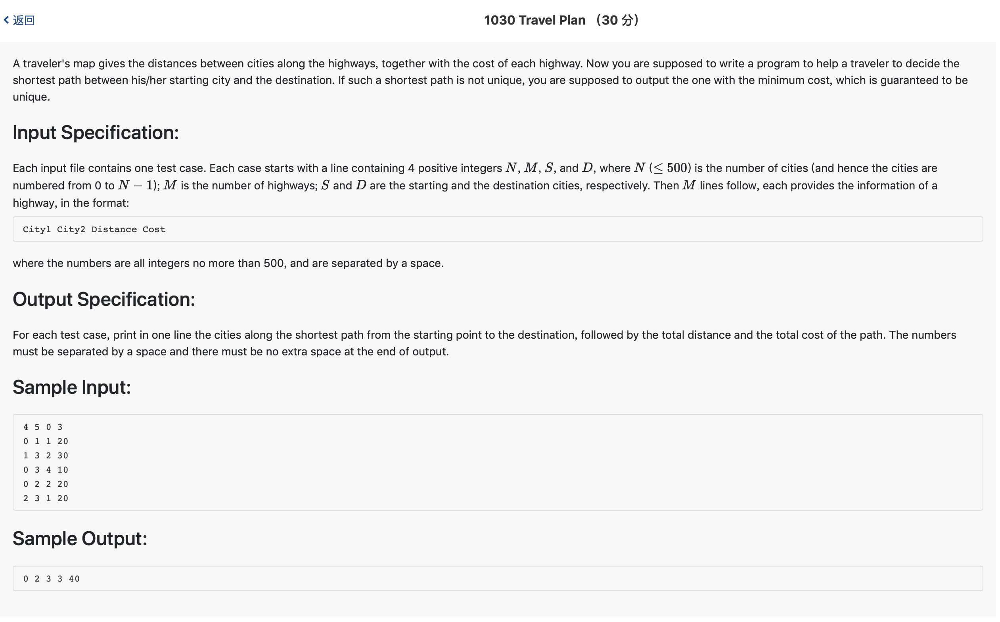

# 1030 Travel Plan （30 分)



题解: dijkstra算法变形，相当于多条件的最短路径。

```c++
#include <iostream>
#include <vector>
#include <climits>
using namespace std;


int map[510][510];
int weight[510][510];
int n, m, s, e;
int di[510];
int wi[510];
int visit[510];
int road[510];

void dij() {
    for(int i = 0; i < n; ++i) {
        di[i] = INT_MAX - 1;
        visit[i] = 0;
        wi[i] = INT_MAX - 1;
        road[i] = i;
    }
    di[s] = 0;
    wi[s] = 0;
    road[s] = s;
    for(int i = 0; i < n ; ++i) {
        int minn, minw = INT_MAX - 1;
        int minww = INT_MAX - 1;
        for(int j = 0; j < n; ++j) {
            if(di[j] < minw && !visit[j]) {
                minn = j;
                minww = wi[j];
                minw = di[j];
            } 
        }
        visit[minn] = 1;

        for(int j = 0; j < n; ++j) {
                if(di[minn] + map[minn][j] < di[j] && !visit[j] && map[minn][j] < INT_MAX - 1) { //注意判断是否连通
                    di[j] = di[minn] + map[minn][j];
                    wi[j] = wi[minn] + weight[minn][j];
                    road[j] = minn;
                } else if (di[minn] + map[minn][j] == di[j] && !visit[j] && map[minn][j] < INT_MAX - 1 && wi[minn] + weight[minn][j] < wi[j]) {
                    wi[j] = wi[minn] + weight[minn][j];
                    road[j] = minn;
                }
            }
    }

    int k = e;
    vector <int> tmp;
    while(k != s) {
        tmp.push_back(k);
        k = road[k];
    }
    cout << s ;
    for(int i = tmp.size() - 1;i>= 0; --i) {
        cout << ' ' << tmp[i];
    }
    cout << ' ' << di[e];
    cout << ' ' << wi[e];
}

int main() {
    // cout << (int)(INT_MAX) << endl;
    
    scanf("%d %d %d %d", &n, &m, &s, &e);
    for(int i = 0; i < n; ++i) {
        for(int j = 0; j < n ;++j) {
            if(i != j) {
                weight[i][j] = INT_MAX - 1;
                map[i][j] = INT_MAX - 1;
            }
        }
    }
    for(int i = 0; i < m; ++i) {
        int a, b, d, w;
        scanf("%d %d %d %d", &a, &b, &d, &w);
        map[a][b] = d;
        map[b][a] = d;
        weight[a][b] = w;
        weight[b][a] = w;
    }
    dij();

}
```