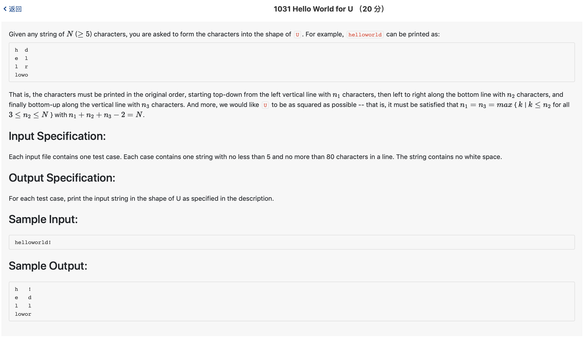

# 1031 Hello World for U （20 分)



题解: 如题。

```c++
#include <iostream>
#include <string>

using namespace std;

string s;

int main() {
    cin >> s;
    int N = s.length();
    int n1, n2;
    int best1 = 0, best2;
    for(n2 = 3; n2 <= N; ++n2) {
        int tmp = N + 2 - n2;
        if(tmp % 2 == 0) {
            n1 = tmp/2;
            if (n1 <= n2) {
                if(best1 < n1) {
                    best1 = n1;
                    best2 = n2;
                }
            }
        }
    }
    int st = 0;
    int en = N - 1;
    for(int i = 0; i < best1 - 1; ++i) {
        cout << s[st];
        for(int j = 0; j < best2 - 2; ++j) {
            cout << ' ';
        }
        cout << s[en];
        st++;
        en--;
        cout << endl;
    }
    int tmp = best1 - 1;
    for(int i = 0; i < best2; ++i) {
        cout << s[tmp];
        tmp++;
    }
    cout << endl;

    
}
```