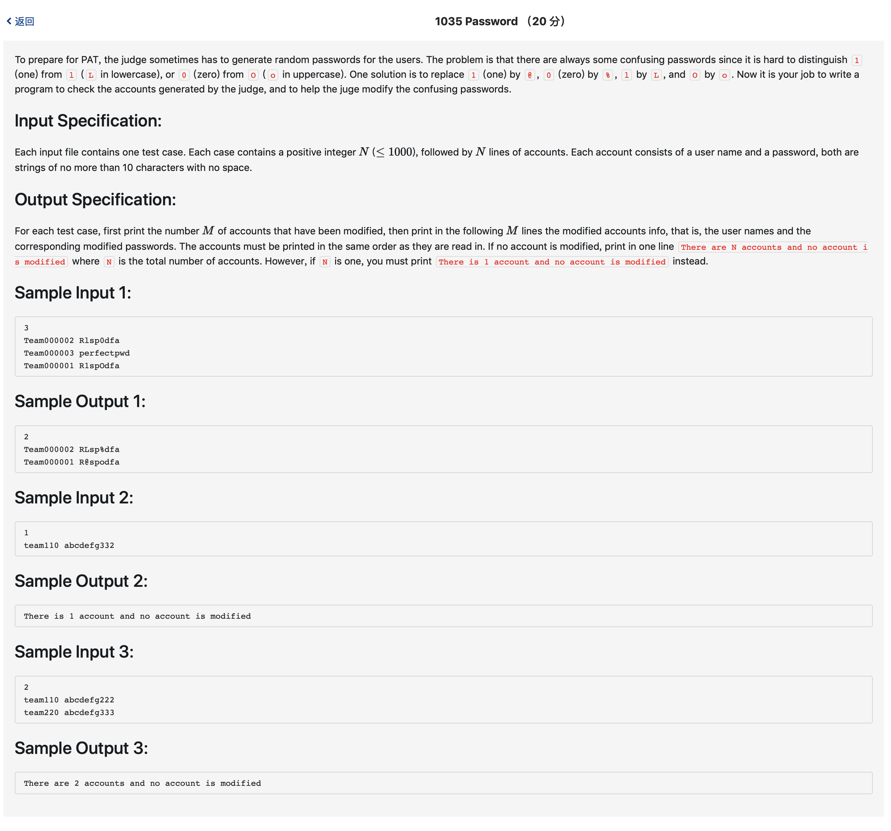

# 1035 Password （20 分)



题解: 字符串遍历加替换。

```c++
#include <iostream>
#include <string>
#include <algorithm>
#include <vector>
using namespace std;

vector <string> name;
vector <string> password;
int n;

int main() {
    cin >> n;
    for(int i = 0; i < n; ++i) {
        string tn, tp;
        cin >> tn >> tp;
        name.push_back(tn);
        password.push_back(tp);
    }
    int count = 0;
    vector <int> res;
    for(int i = 0; i < n; ++i) {
        string tp = password[i];
        int flag = 0;
        for(int j = 0; j < tp.size(); ++j) {
            if(tp[j] == '0') {
                password[i][j] = '%';
                flag = 1;
            } else if (tp[j] == 'O') {
                password[i][j] = 'o';
                flag = 1;
            } else if (tp[j] == 'l') {
                password[i][j] = 'L';
                flag = 1;
            } else if (tp[j] == '1') {
                password[i][j] = '@';
                flag = 1;
            }
        }
        if(flag) {
            res.push_back(i);
            count ++;
        }
    }
    
    if(count > 0) {
        cout << count << endl;
        for(int i = 0; i < res.size(); ++i) {
            cout << name[res[i]] << ' ' << password[res[i]] << endl;
        }
    } else {
        if(n == 1) {
            printf("There is 1 account and no account is modified\n");
        } else {
            printf("There are %d accounts and no account is modified\n", n);
        }
    }
}
```