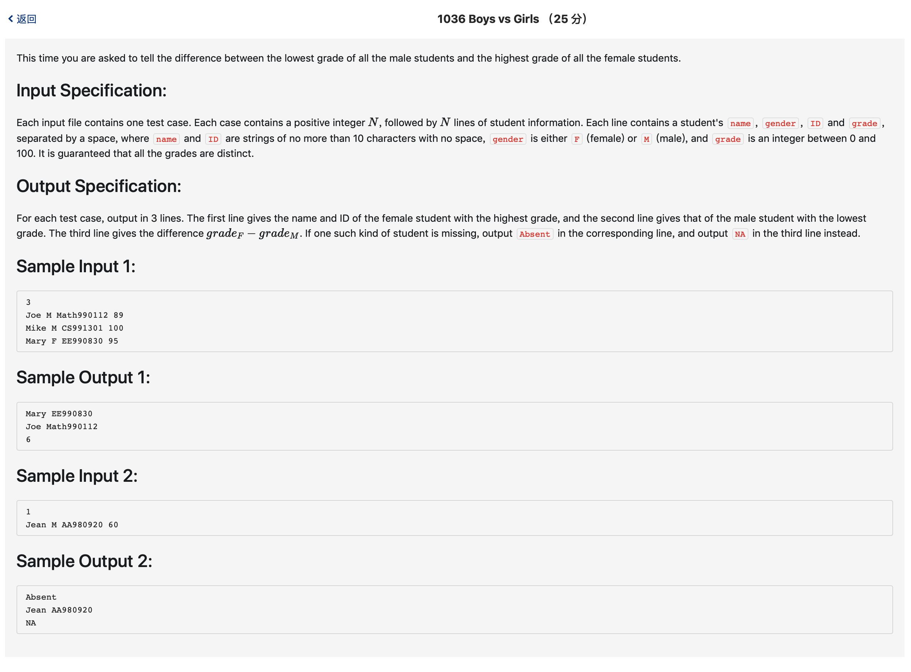

# 1036 Boys vs Girls （25 分)



题解: 简单字符串处理，记录最高分和最低分。

代码其实没必要排序，只需要记录最高分的索引即可。

```c++

#include <iostream>
#include <string>
#include <vector>
#include <algorithm>
using namespace std;

typedef struct info {
    string name;
    char sex;
    string cname;
    int score;
}info;

int cmp(info a, info b) {
    return a.score > b.score;
}

vector <info> boy, girl;
int n;

int main() {
    cin >> n;
    for(int i = 0; i < n ; ++i)  {
        string tn, tc;
        char ts;
        int sc;
        cin >> tn >> ts >> tc >> sc;
        info tmp;
        tmp.name = tn;
        tmp.score = sc;
        tmp.sex = ts;
        tmp.cname = tc;
        switch (ts)
        {
            case 'F': {
                girl.push_back(tmp);
            }break;
            case 'M': {
                boy.push_back(tmp);
            }break;
        }

    }
    sort(boy.begin(), boy.end(), cmp);
    sort(girl.begin(), girl.end(), cmp);
    if(boy.empty() || girl.empty()) {
        
        if(boy.empty()) {

            cout << girl[0].name << ' ' << girl[0].cname << endl;
            cout << "Absent" << endl;
            cout << "NA" << endl;
        } else if (girl.empty()) {
            cout << "Absent" << endl;
            cout << boy[boy.size() - 1].name << ' ' << boy[boy.size() - 1].cname << endl;
            cout << "NA" << endl;
        }
    } else {
        cout << girl[0].name << ' ' << girl[0].cname << endl;
        cout << boy[boy.size() - 1].name << ' ' << boy[boy.size() - 1].cname << endl;
        cout << girl[0].score - boy[boy.size() - 1].score << endl;
    }
    
}

```