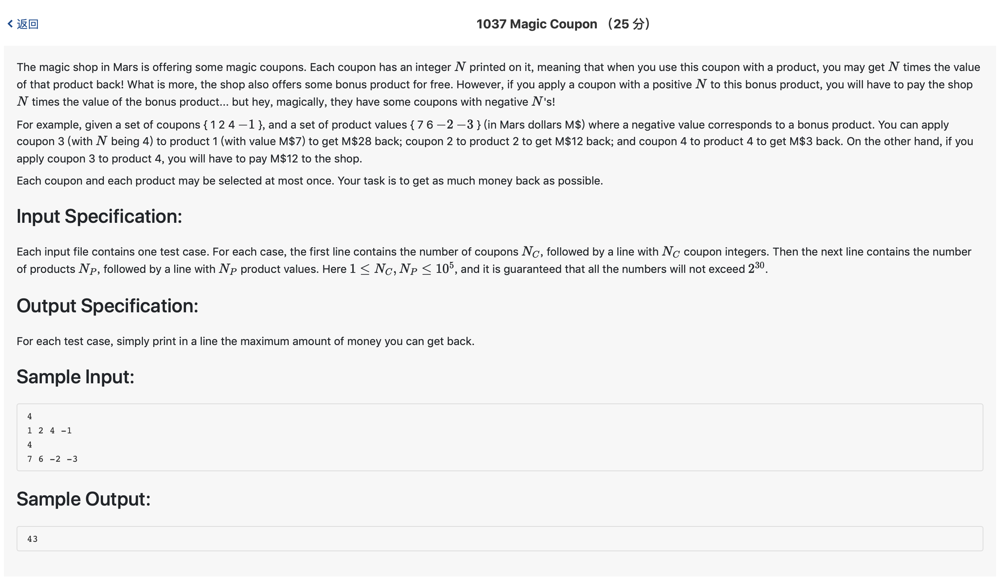

# 1037 Magic Coupon （25 分)



题解: 排序加配对，正和正配对，负和负配对，乘起来大的优先。

```c++
#include <iostream>
#include <algorithm>
#include <vector>

using namespace std;

vector <int> coupon, product;
int n, m;
int main() {
    cin >> n;
    for(int i = 0; i < n; ++i) {
        int tmp;
        cin >> tmp;
        coupon.push_back(tmp);
    }
    cin >> m;
    for(int i = 0; i < m; ++i) {
        int tmp;
        cin >> tmp;
        product.push_back(tmp);
    }
    sort(coupon.begin(), coupon.end());
    sort(product.begin(), product.end());
    
    vector <int> cg, cl, pg, pl;
    for(int i = 0; i < coupon.size(); ++i) {
        if(coupon[i] > 0) {
            cg.push_back(coupon[i]);
        } else if (coupon[i] < 0) {
            cl.push_back(coupon[i]);
        }
    }
    for(int i = 0; i < product.size(); ++i) {
        if(product[i] > 0) {
            pg.push_back(product[i]);
        } else if (product[i] < 0) {
            pl.push_back(product[i]);
        }
    }


    int sum = 0;
    int k = 0, s = 0;
    while(k < cl.size() && s < pl.size()) {
        sum += cl[k]*pl[s];
        k++;
        s++;
    }
    k = cg.size() - 1;
    s = pg.size() - 1;
    while(k >= 0 && s >= 0) {
        sum += cg[k]*pg[s];
        k--;
        s--;
    }
    cout << sum << endl;
}
```