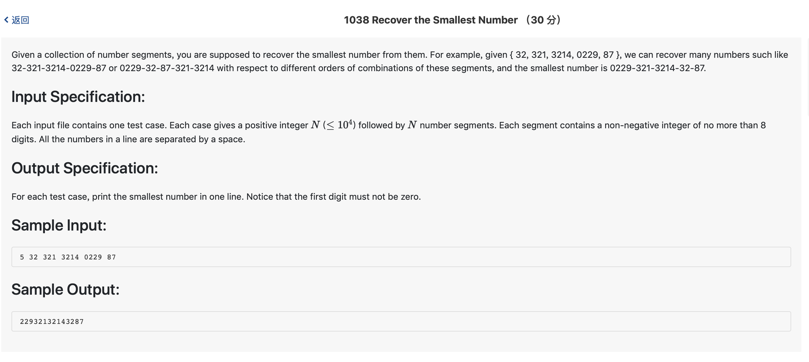

# 1038 Recover the Smallest Number （30 分)



题解: 排序，注意前面有0的字符串的情况，除了放在开头，其余地方的0都不能去掉。

```c++

#include <iostream>
#include <algorithm>
#include <string>
#include <vector>
using namespace std;


int cmp(string a, string b) {
    return a + b < b + a;
}
vector <string > v;
int n;
int main() {
    cin >> n;
    for(int i = 0; i < n; ++i) {
        string tmp;
        cin >> tmp;
        v.push_back(tmp);
    }
    sort(v.begin(), v.end(), cmp);
    int last = 0;
    int flag = 0;
    for(int i = 0; i < v.size(); ++i) {
        string res = v[i];
        if(last == 0) {
            int j = 0;
            while(res[j] == '0') {
                res.erase(0, 1);
            }
        }
        if(res.size() > 0) {
            flag = 1;
        }
        cout << res;
        last = atoi(res.data());
    }
    if(!flag) {
        cout << 0;
    }
    cout << endl;
}
```