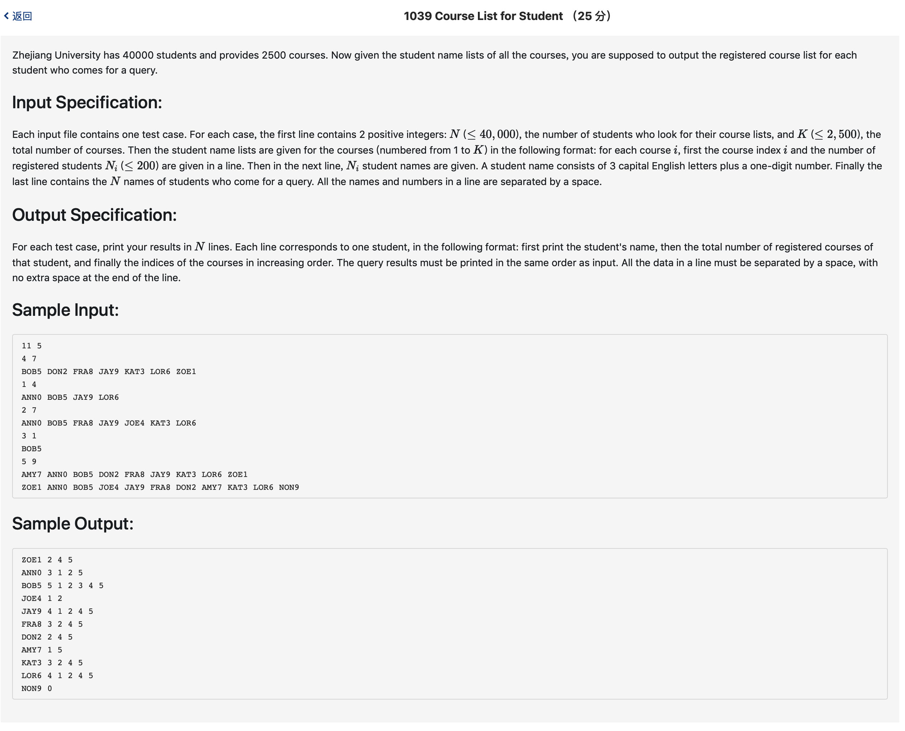

# 1039 Course List for Student （25 分)



题解: 仍然是排序，注意用scanf输入，否则会超时。用map存放，查找速度快。

```c++
#include <iostream>
#include <string>
#include <map>
#include <vector>
#include <algorithm>
using namespace std;

typedef struct arr {
    vector <int> num;
    int count;
} arr;


map <string, arr> v;

int n, m;

int main() {
    cin >> n >> m;
    for(int i = 0; i < m; ++i) {
        int course, namen;
        cin >> course >> namen;
        for(int j = 0; j < namen; ++j) {
            char s[5];
            scanf("%s", s);
            string name = s;
            // cin >> name;
            map <string, arr> :: iterator it;
            it = v.find(name);
            if(it != v.end()) {
                it->second.num.push_back(course);
                it->second.count ++;
            } else {
                arr tmp;
                tmp.count = 0;
                v.insert(make_pair(name, tmp));
                // v[name].num[course] = 1;
                v[name].num.push_back(course);
                v[name].count ++;
            }
        }
    }
    for(int i = 0; i < n; ++i) {
        char s[5];
        scanf("%s", s);
        string name = s;
        map <string, arr> :: iterator it;
        it = v.find(name);
        if(it == v.end()) {
            cout << name << ' ' << '0';
        } else {
            cout << name << ' ' << v[name].count;
            sort(v[name].num.begin(), v[name].num.end());
            for(int j = 0; j < v[name].count; ++j) {
                cout << ' ' << v[name].num[j];
            }
        }
        cout << endl;
    }
}
```