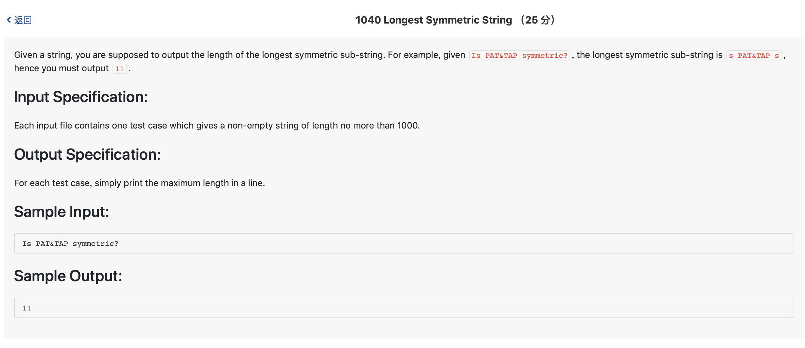

# 1040 Longest Symmetric String （25 分)



题解: 将reverse后的字符串和原来的字符串进行遍历(从头到尾), 相同的子串即为符合要求的，记录下长度最长的串即可。

```c++
#include <iostream>
#include <string.h>
#include <stdio.h>


using namespace std;

char s1[1001];
char s2[1001];

int main() {
    char c;
    int k = 0;
    while((c = getchar()) != '\n') {
        s1[k++] = c;
    }
    int length = strlen(s1);
    for(int i = 0; i < length; ++i) {
        s2[i] = s1[length - i - 1];
    }
    int maxl = 0;
    int i = 0;
    while (i < length) {
        int lasti = i;
        int count = 0;
        int j = 0;
        while(j < length) {
            int ccount = 0;
            int lastj = j;
            while (i < length && j < length && s1[i] == s2[j]) {
                i ++;
                j ++;
                ccount += 1;
            }
            if(ccount > count) {
                count = ccount;
            }
            j ++;
            i = lasti;
        }
        if(count > maxl) {
            maxl = count;
        }
        i = lasti + 1;
    }
    cout << maxl << endl;
}

```