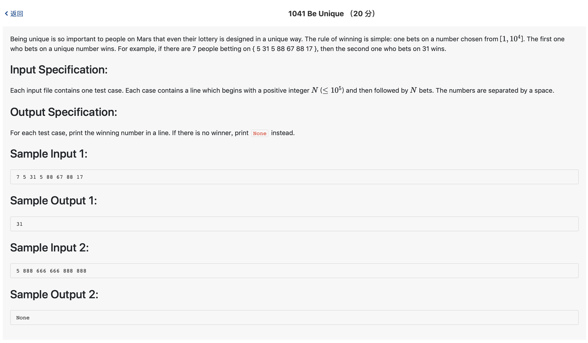

# 1041 Be Unique （20 分)



题解: 遍历即可解决，处理好数据结构。

可以使用map存放，效率更高。

```c++

#include <iostream>
#include <vector>
using namespace std;

typedef struct info {
    int num[100001];
    int firstflag[100001];
} info;

info res;
int n;

int main() {
    cin >> n;
    for(int i = 0; i < 100001; ++i) {
        res.num[i] = 0;
        res.firstflag[i] = 0;
    }
    for(int i = 0; i < n; ++i) {
        int tmp;
        // cin  >> tmp;
        scanf("%d", &tmp);
        res.num[tmp] += 1;
        if(! res.firstflag[tmp]) {
            res.firstflag[tmp] = i;
        }
    }
    int minnum = 1000000, minres;
    int find = 0;
    for(int i = 1; i <= 100000; ++i) {
        if(res.num[i] == 1) {
            if(minnum > res.firstflag[i]) {
                find = 1;
                minnum = res.firstflag[i];
                minres = i;
            }
        }
    }
    if(!find) {
        cout << "None" << endl;
    } else {
        cout << minres << endl;
    }

}
```