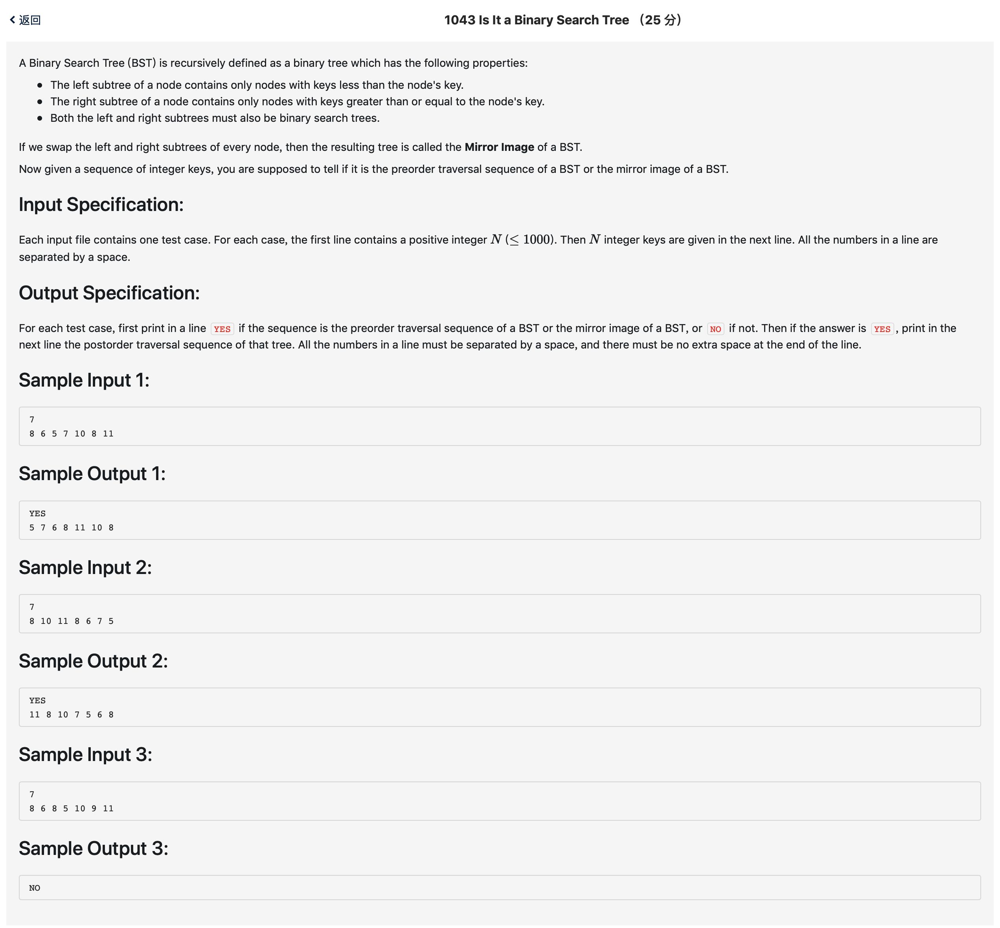

# 1043 Is It a Binary Search Tree （25 分)



题解: 建树，如果能够成功建成，那么就是BST或者MIBST，否则就不是二叉搜索树。建树的过程判断是否符合搜索树或镜像搜索树的条件。

```c++
#include <iostream>

using namespace std;
enum {LEFT, RIGHT} ;
typedef struct tree {
    int val;
    struct tree *lchild;
    struct tree *rchild;
}tree;

int testn, n;
int preorder[10001];
int curi = 0;
tree *tr;
int tara, tarb;

tree *createTree(tree *t, int key) {
    if(!t) {
        t = new tree;
        t->val = key;
        t->lchild = NULL;
        t->rchild = NULL;
        return t;
    } else {
        if(key < t->val) {
            t->lchild = createTree(t->lchild , key);
        } else {
            t->rchild = createTree(t->rchild, key);
        }
    }
    return t;
}

tree *createTree(int left, int right) {
    
    int now = preorder[left];
    int divide = left;
    tree *p = new tree;
    p->val = now;
    for(int i = left; i <= right; ++i) {
        if(preorder[i] > now) {
            divide = i;
            break;
        }
    }
    // cout << left << ' ' << divide << ' ' << right << endl;
    if(left == right) {
        p->lchild = NULL;
        p->rchild = NULL;
        return p;
    }
    
    int leftL = left + 1;
    int leftR = divide - 1;
    int rightL = divide;
    int rightR = right;
    if(divide == left) {
        p->lchild = createTree(left + 1, right);
    }else if(divide != left + 1) {
        p->lchild = createTree(leftL, leftR);
    } else {
        p->lchild = NULL;
    }
    if(divide != left) {
        p->rchild = createTree(rightL, rightR);
    } else {
        p->rchild = NULL;
    }
    return p;
}


void preordertravel(tree *t) {
    if(!t) {
        return ;
    }
    cout << t->val << ' ';
    if(t->lchild) {
        preordertravel(t->lchild);
    } 
    if(t->rchild) {
        preordertravel(t->rchild);
    }
}

tree *LCA(tree *root, int u, int v) { //查找两节点最近祖先 
    if (root == NULL) return NULL;
    if (root->val== u || root->val== v) return root;
    tree *left =LCA(root->lchild,u,v);
    tree *right = LCA(root->rchild,u,v);
    if (left && right ) return root; //u,v分别位于左右子树的情况
    return left == NULL ? right : left;
}

int main() {
    scanf("%d %d", &testn, &n);
    for(int i = 1; i <= n; ++i) {
        scanf("%d", &preorder[i]);
    }
    tr = createTree(1, n);
    // preordertravel(tr);
    for(int i = 1; i <= testn; ++i) {
        scanf("%d %d", &tara, &tarb);
        int hasa = 0, hasb = 0;
        for(int j = 1; j <= n; ++j) {
            if(tara == preorder[j]) {
                hasa = 1;
            } 
            if(tarb == preorder[j]) {
                hasb = 1;
            }
        }
        if(hasa && hasb) {
            tree *res = LCA(tr, tara, tarb);
            if(res->val == tara){
                printf("%d is an ancestor of %d.\n", tara, tarb);
            } else if (res->val == tarb) {
                printf("%d is an ancestor of %d.\n", tarb, tara);
            }else {
                printf("LCA of %d and %d is %d.\n", tara, tarb, res->val);
            }
        } else {
            if(!hasa && !hasb) {
                printf("ERROR: %d and %d are not found.\n", tara, tarb);
            } else if (!hasa) {
                printf("ERROR: %d is not found.\n", tara);
            } else if (!hasb){
                printf("ERROR: %d is not found.\n", tarb);
            }
        }

    }
}

```