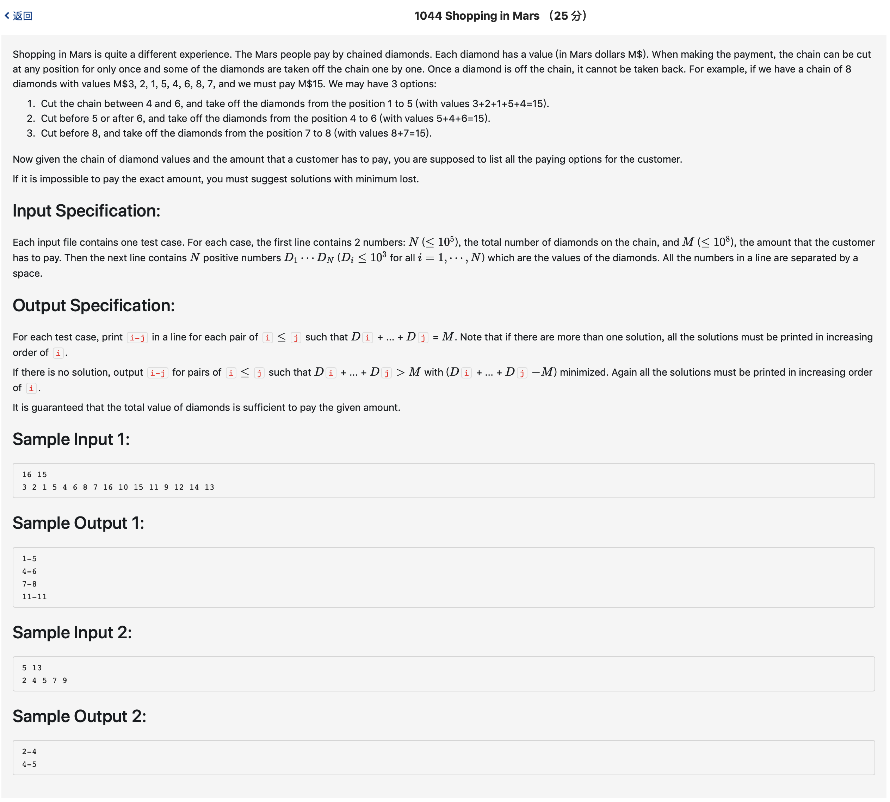

# 1044 Shopping in Mars （25 分)



题解: 用一个数组存放n[i] = D1 + ... + Di , 然后搜索子串，第一层用遍历，第二层用二分搜索确定。

```c++

#include <iostream>
#include <vector>
using namespace std;
int n, m;
long long d[100001];
vector <int> resi, resj;
vector <int> lasti, lastj;
long long minMoney = 100000000;
int main() {
    scanf("%d %d", &n, &m);
    for(int i = 1; i <= n; ++i) {
        if(i == 1) {
            scanf("%lld", &d[i]);
        } else {
            long long tmp;
            scanf("%lld", &tmp);
            d[i] = d[i - 1] + tmp;
        }
    }

    for(int i = 0; i < n; ++i) {
        int start = i + 1;
        int end = n, mid;
        while(start < end) {
            int mid = (start + end)/2;
            if(d[mid] - d[i] >= m) {
                end = mid;
            } else {
                start = mid + 1;
            }
        }
        int cmoney = d[end] - d[i];
        if(cmoney == m) {
            resi.push_back(i);
            resj.push_back(end);
        } else {
            if(cmoney < minMoney && cmoney > m) {
                minMoney = cmoney;
                lasti.clear();
                lastj.clear();
                lasti.push_back(i);
                lastj.push_back(end);
            } else if (cmoney == minMoney) {
                lasti.push_back(i);
                lastj.push_back(end);
            }
        }
    }
    if(resi.size()) {
        for(int i = 0; i < resi.size(); ++i) {
            printf("%d-%d\n", resi[i] + 1, resj[i]);
        }
    } else {
        for(int i = 0; i < lasti.size(); ++i) {
            printf("%d-%d\n", lasti[i] + 1, lastj[i]);
        }
    }
}

```