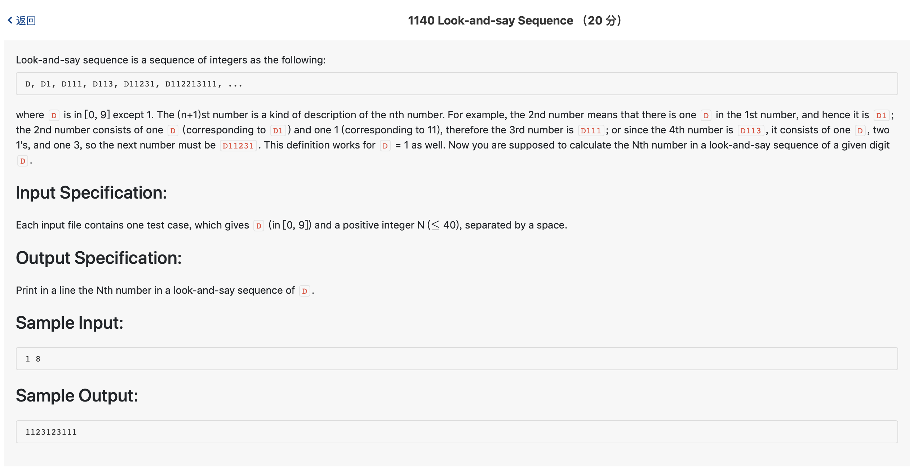

# 1140 Look-and-say Sequence （20 分)



题解: 这道题难度在于看懂题目，看懂之后模拟即可。


```c++
#include <iostream>
#include <vector>
#include <string>
using namespace std;

int n;

int main() {
    string D;
    cin >> D >> n;
    for(int i = 0; i < n - 1; ++i) {
        // cout << D << endl;
        string tmp = "";
        char num = D[0];
        int count = 0;
        for(int j = 0; j < D.size(); ++j) {
            if(num != D[j] && j != 0) {
                tmp += num;
                tmp += to_string(count);
                num = D[j];
                count = 0;
            }
            count ++;
        }
        tmp += num;
        tmp += to_string(count);
        D = tmp;
    }
    cout << D << endl;
}
```