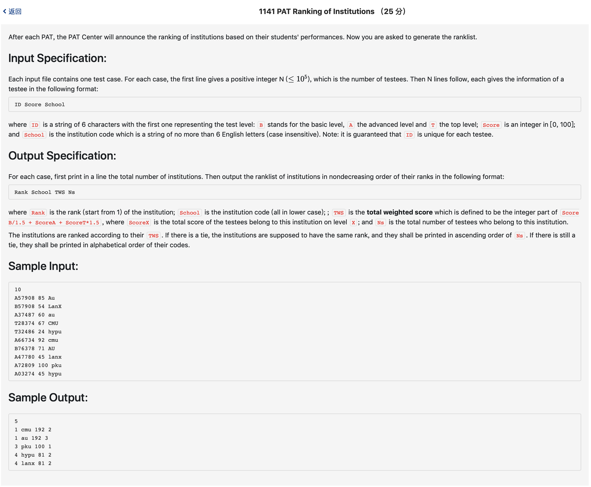

# 1141 PAT Ranking of Institutions （25 分)



题解: 字符串处理，计数。注意先用double进行加法，最后要输出才转成int，否则会计算错误。用map存放效率比较高。

```c++
#include <iostream>
#include <map>
#include <algorithm>
#include <vector>
using namespace std;
typedef struct info {
    string sch;
    double score;
    int num;
}info;
vector <info> res;

map <string, info> record;
int n;

bool cmp(info a, info b) {
    if (a.score != b.score)
        return a.score > b.score;
    else if (a.num != b.num)
        return a.num < b.num;
    else
        return a.sch < b.sch;
}
void insertMap(string id, string school, double score) {

    switch (id[0])
    {
        case 'T': {
            score *= 1.5;
        } break;
        case 'B': {
            score /= 1.5;
        }break;
    }
    string :: iterator it = school.begin();
    while(it != school.end()) {
        if(*it >= 'A' && *it <= 'Z') {
            *it = *it - 'A' + 'a';
        }
        it++;
    }
    map <string, info> :: iterator mit = record.find(school);
    if(mit == record.end()) {
        info tmp;
        tmp.score = score;
        tmp.num = 1;
        tmp.sch = school;
        record.insert(make_pair(school, tmp));
    } else {
        mit->second.score += score;
        mit->second.num += 1;
    }
}   

void getRes() {
    map <string, info> :: iterator it = record.begin();
    while(it != record.end()) {
        it->second.score = (int)it->second.score;
        res.push_back(it->second);
        it++;
    }
    sort(res.begin(), res.end(), cmp);
    int pre = res[0].score, count = 1;
    cout << res.size() << endl;
    for(int i = 0; i < res.size(); ++i) {
        if(res[i].score != pre) {
            count = i + 1;
        }
        printf("%d %s %d %d\n", count, res[i].sch.data(), (int)res[i].score, res[i].num);
        pre = res[i].score;
    }
}


int main() {
    scanf("%d", &n);
    for(int i = 0; i < n; ++i) {
        char buf1[10], buf2[10]; 
        double score;
        scanf("%s %lf %s", buf1, &score, buf2);
        string id = buf1;
        string sc = buf2;
        insertMap(id, sc, score);
    }
    getRes();
    
}
```