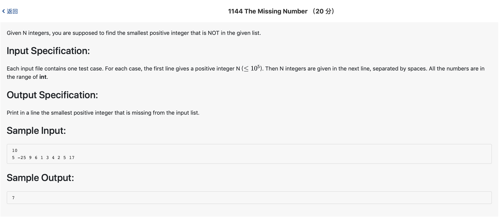

# 1144 The Missing Number （20 分)



题解: 用map(map会自动排序)存放，排序之后搜索，注意0的情况。

```c++
#include <iostream>
#include <map>
using namespace std;

map <int, int> m;
int n;

int find() {
    map <int, int> :: iterator it = m.begin();
    int pre = -1;
    while(it != m.end()) {
        if(it->first > 0) {
            if(pre >= 0 && it->first - pre > 1) {
                return pre + 1;
            }
        }
        pre = it->first;
        it++;
    }
    it--;
    // cout << m.end()->first << endl;
    return it->first >= 0? it->first + 1: 1;
}

int main(){
    scanf("%d", &n);
    for(int i = 0 ; i < n ; ++i) {
        int tmp;
        scanf("%d", &tmp);
        map <int, int> :: iterator it = m.find(tmp);
        if(it == m.end()) {
            m.insert(make_pair(tmp, 1));
        }
    }
    cout << find() << endl;
}
```