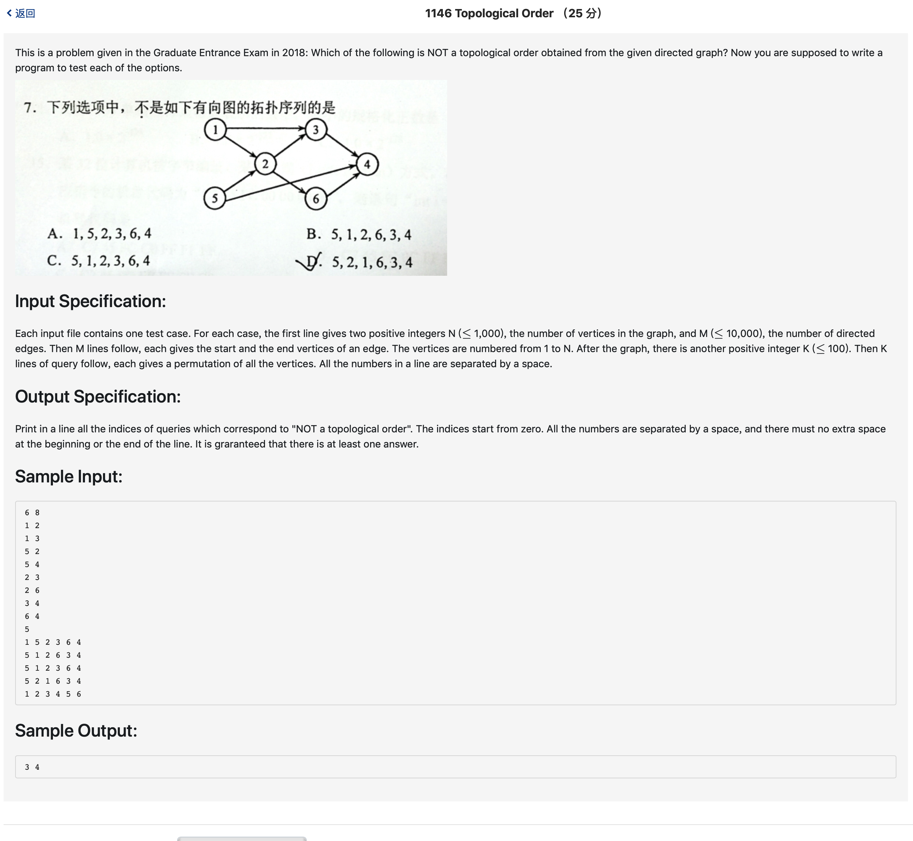

# 1146 Topological Order （25 分)



题解: 拓扑排序。

```c++
#include <iostream>
#include <vector>
using namespace std;

vector <int> res;
int map[1001][1001];
int copymap[1001][1001];
int n, m;
int tmp[1001];

void copyM() {
    for(int i = 1; i <= n; ++i) {
        for(int j = 1; j <= n; ++j) {
            copymap[i][j] = map[i][j];
        }
    }
}

void isTopu(int num) {
    copyM();

    int flag = 1;
    for(int i = 0; i < n; ++i) {
        int c = tmp[i];
        for(int j = 1; j <= n; ++j) {
            if(copymap[j][c] == 1) {
                flag = 0;
                break;
            }
        }
        if(!flag) {
            break;
        }
        for(int j = 1; j <= n; ++j) {
            copymap[c][j] = 0;
        }
    }
    if(!flag) {
        res.push_back(num);
    }
}

int main() {
    scanf("%d %d", &n, &m);
    for(int i = 0; i < m; ++i) {
        int a, b;
        scanf("%d %d", &a, &b);
        map[a][b] = 1;
    }
    int testn;
    scanf("%d", &testn);
    for(int i = 0; i < testn; ++i) {
        for(int j = 0; j < n; ++j) {
            scanf("%d", &tmp[j]);
        }
        isTopu(i);
    }
    vector <int> :: iterator it = res.begin();
    printf("%d", *it);
    while(++it != res.end()) {
        printf(" %d", *it);
    }
    printf("\n");
}

```