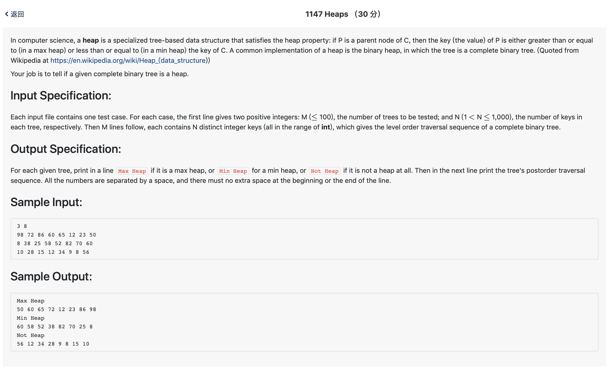

# 1147 Heaps （30 分)



题解: 先序遍历验证是否是最大堆或最小堆。

```c++

#include <iostream>
#include <vector>
#include <algorithm>
using namespace std;

int testn, n;
int tree[1100];
vector <int> path;
int getleft(int now) {
    return now*2 ;
}
int getright(int now) {
    return now*2 + 1;
}


void postOrderTravel(int now) {
    int left = getleft(now);
    int right = getright(now);
    if(left <= n) {
        postOrderTravel(left);
    }
    if(right <= n) {
        postOrderTravel(right);
    }
    path.push_back(tree[now]);
}

int isMaxHeap() {
    int i = 1;
    int left, right;
    int flag = 1;
    while(i <= n) {
        left = getleft(i);
        right = getright(i);
        if(left <= n) {
            if(tree[left] > tree[i]) {
                flag = 0;
                break;
            }
        }
        if(right <= n) {
            if(tree[right] > tree[i]) {
                flag = 0;
                break;
            }
        }
        i++;
    }
    return flag;
}

int isMinHeap() {
    int i = 1;
    int left, right;
    int flag = 1;
    while(i <= n) {
        left = getleft(i);
        right = getright(i);
        if(left <= n) {
            if(tree[left] < tree[i]) {
                flag = 0;
                break;
            }
        }
        if(right <= n) {
            if(tree[right] < tree[i]) {
                flag = 0;
                break;
            }
        }
        i++;
    }
    return flag;
}
int main() {
    scanf("%d %d", &testn, &n);
    for(int i = 0; i < testn; ++i) {
        path.clear();
        for(int j = 1; j <= n; ++j) {
            scanf("%d", &tree[j]);
        }
        if(isMaxHeap()) {
            printf("Max Heap\n");
        } else if(isMinHeap()) {
            printf("Min Heap\n");
        } else {
            printf("Not Heap\n");
        }
        postOrderTravel(1);
        vector <int> :: iterator it = path.begin();
        printf("%d", *it++);
        while(it != path.end()) {
            printf(" %d", *it++);
        }
        putchar('\n');
    }
}

```