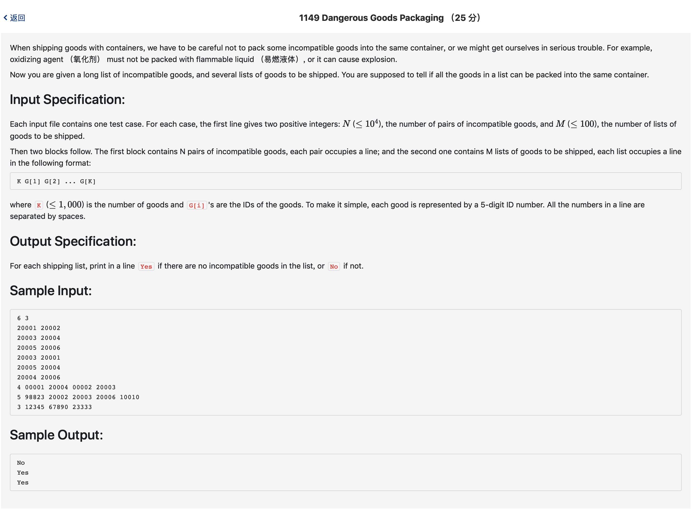

# 1149 Dangerous Goods Packaging （25 分)



题解: 暴力搜索。

用vector存放对应关系，因为序号不超过5位数。

```c++
#include <iostream>
#include <vector>
using namespace std;

vector <int> ma[100001];
int n, testn;

int main() {
    scanf("%d %d", &n, &testn);
    for(int i = 0; i < n; ++i) {
        int a, b;
        scanf("%d %d", &a, &b);
        ma[a].push_back(b);
    }
    for(int i = 0; i < testn; ++i) {
        int k;
        scanf("%d", &k);
        int goods[1001];
        // printf("111\n");
        for(int j = 0; j < k; ++j) {
            scanf("%d", &goods[j]);
        }
        int find = 0;
        for(int j = 0; j < k; ++j) {
            int cgood = goods[j];
            // cout << cgood << endl;
            if(!ma[cgood].empty()) {
                vector <int> :: iterator it = ma[cgood].begin();
                while(it != ma[cgood].end()) {
                    for(int w = 0; w < k; ++w) {
                        if(goods[w] == *it) {
                            find = 1;
                            break;
                        }
                        if(find) {
                            break;
                        }
                    }
                    it ++;
                }
            }
            if(find) {
                printf("No\n");
                break;
            }
        }
        if(!find) {
            printf("Yes\n");
        }
    }
}
```