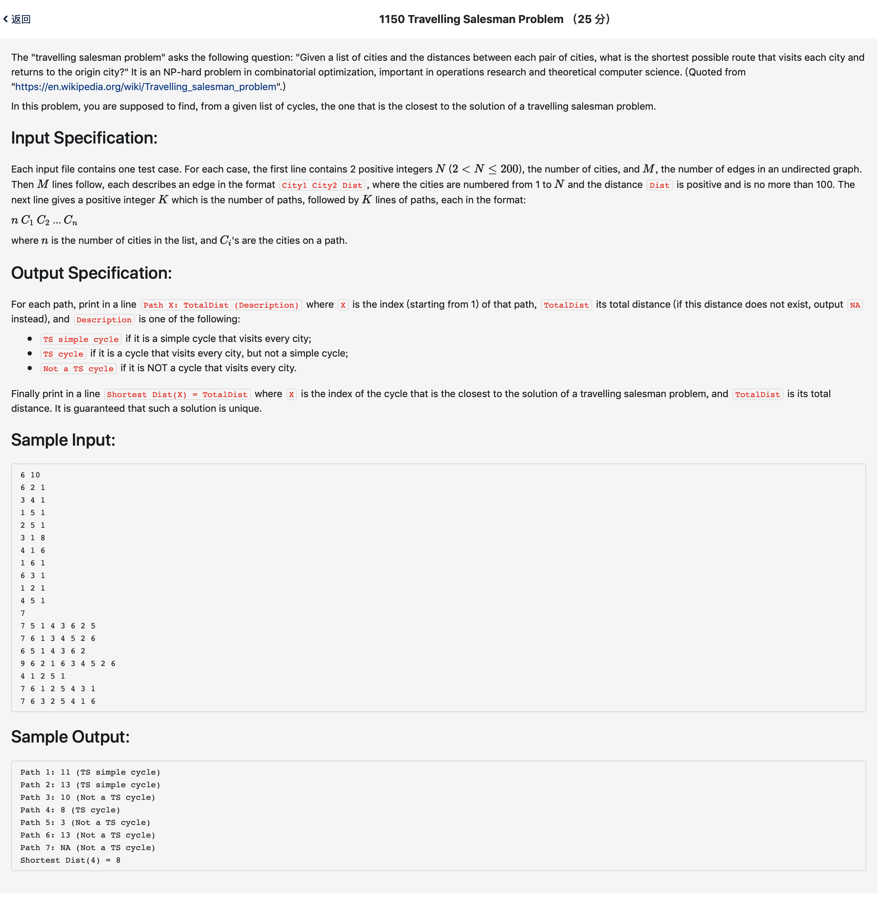

# 1150 Travelling Salesman Problem （25 分)



题解: 判断是否成环，是否是简单的环，并记录成环的路径中的最短路径。


```c++
#include <iostream>
#include <vector>
#define MAX 1000000
using namespace std;

int matrix[201][201];

int visit[1001];
int n, m, t;
int mind = 1000000;
int mini;

void init() {
    for(int i = 1; i <= n; ++i) {
        visit[i] = 0;
    }
}

int allvisited() {
    int flag = 0;
    for(int i = 1; i <= n; ++i) {
        if(!visit[i]) {
            flag = 0;
            break;
        }
        flag += visit[i];
    }
    if(flag == 0) {
        return flag;
    } else if (flag == n + 1) {
        return 1;
    } else {
        return 2;
    }
}


int main() {
    cin >> n >> m ;
    for(int i = 1; i <= n; ++i) {
        for(int j = 1; j <= n; ++j) {
            if(i != j) {
                matrix[i][j] = MAX;
            }
        }
    }
    for(int i = 0; i < m; ++i) {
        int a, b, w;
        cin >> a >> b >> w;
        matrix[a][b] = w;
        matrix[b][a] = w;
    }
    cin >> t;
    for(int i = 0; i < t; ++i) {
        int tmp;
        init();
        cin >> tmp;
        vector <int> path;
        int dist = 0;
        int na = 0;
        for(int j = 0; j < tmp; ++j) {
            int next;
            cin >> next;
            path.push_back(next);
            visit[next] += 1;
            if(j != 0) {
                if(matrix[path[j - 1]][next] == MAX) {
                    na = 1;
                }
                dist += matrix[path[j - 1]][next];
            }
        }
        if(!na) {
            if(path[0] == path[path.size() - 1]) {
                int k = allvisited();
                if(k == 2) {
                    printf("Path %d: %d (TS cycle)\n", i + 1, dist);
                    if(dist < mind) {
                        mind = dist;
                        mini = i + 1;
                    }
                } else if(k == 1){
                    printf("Path %d: %d (TS simple cycle)\n", i + 1, dist);
                    if(dist < mind) {
                        mind = dist;
                        mini = i + 1;
                    }
                } else {
                    printf("Path %d: %d (Not a TS cycle)\n", i + 1, dist);
                }
            } else {
                printf("Path %d: %d (Not a TS cycle)\n", i + 1, dist);
            }
        } else {
            printf("Path %d: NA (Not a TS cycle)\n", i + 1);
        }
    }
    printf("Shortest Dist(%d) = %d\n", mini, mind);
}

```
