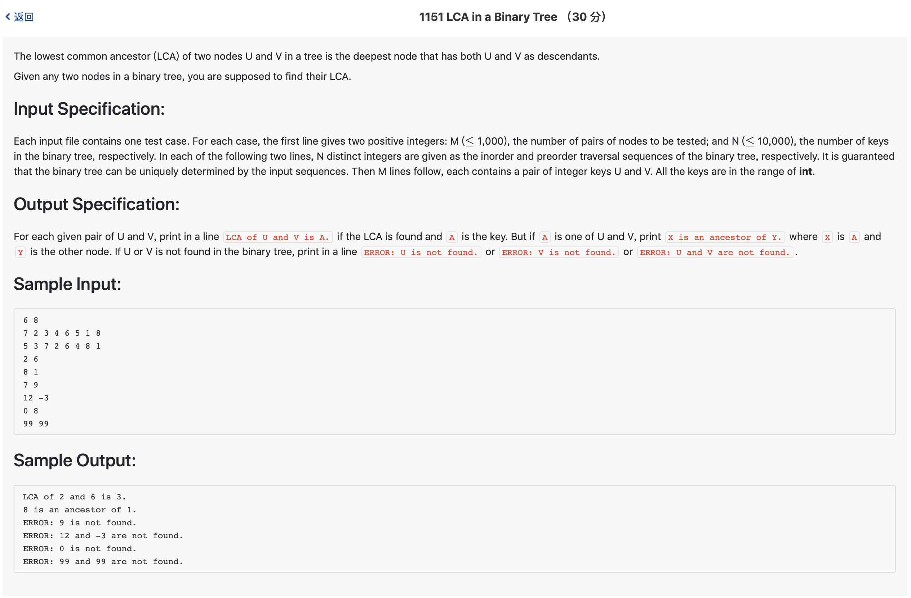

# 1151 LCA in a Binary Tree （30 分)



题解: 主要还是建树的过程，只要建树之后，就能解决问题。

```c++

#include <iostream>
#include <stdio.h>
#include <vector>
using namespace std;
//不要用字典映射，直接建树能过，
typedef struct pTree {
    int val;
    struct pTree *leftNode;
    struct pTree *rightNode;
} pTrees;

int preorder[10010];
int inorder[10010];
int testn, n;
int curi = 0;
pTrees *tree;
int tara, tarb;

pTrees *creatTree(int left, int right) {
    curi += 1;
    int now = preorder[curi];
    if(left == right || curi == n) {
        pTrees *p = new pTrees;
        p->leftNode = NULL;
        p->rightNode = NULL;
        p->val = now;
        return p;
    }
    int divide;
    for(int i = 1; i <= n; ++i) {
        if(inorder[i] == now) {
            divide = i;
            break;
        }
    }
    int leftL = left;
    int leftR = divide - 1;
    int rightL = divide + 1;
    int rightR = right;
    pTrees *p = new pTrees;
    p->val = now;
    if(left != divide) {
        p->leftNode = creatTree(leftL, leftR);
    } else {
        p->leftNode = NULL;
    }
    if(right != divide) {
        p->rightNode = creatTree(rightL, rightR);
    } else {
        p->rightNode = NULL;
    }
    return p;
}
pTrees *LCA(pTrees *root, int u, int v) { //查找两节点最近祖先 
    if (root == NULL) return NULL;
    if (root->val== u || root->val== v) return root;
    pTrees *left =LCA(root->leftNode,u,v);
    pTrees *right = LCA(root->rightNode,u,v);
    if (left && right ) return root; //u,v分别位于左右子树的情况
    return left == NULL ? right : left;
}


int main() {
    cin >> testn >> n;
    for(int i = 1; i <= n; ++i) {
        int tmp;
        scanf("%d", &tmp);
        inorder[i] = tmp;
    }
    for(int i = 1; i <= n; ++i) {
        int tmp;
        scanf("%d", &tmp);
        preorder[i] = tmp;
    }
    tree = creatTree(1, n);
    for(int i = 1; i <= testn; ++i) {
        scanf("%d %d", &tara, &tarb);
        int hasa = 0, hasb = 0;
        for(int j = 1; j <= n; ++j) {
            if(tara == inorder[j]) {
                hasa = 1;
            } 
            if(tarb == inorder[j]) {
                hasb = 1;
            }
        }
        if(hasa && hasb) {
            pTrees *res = LCA(tree, tara, tarb);
            if(res->val == tara){
                printf("%d is an ancestor of %d.\n", tara, tarb);
            } else if (res->val == tarb) {
                printf("%d is an ancestor of %d.\n", tarb, tara);
            }else {
                printf("LCA of %d and %d is %d.\n", tara, tarb, res->val);
            }
        } else {
            if(!hasa && !hasb) {
                printf("ERROR: %d and %d are not found.\n", tara, tarb);
            } else if (!hasa) {
                printf("ERROR: %d is not found.\n", tara);
            } else if (!hasb){
                printf("ERROR: %d is not found.\n", tarb);
            }
        }

    }
}
```