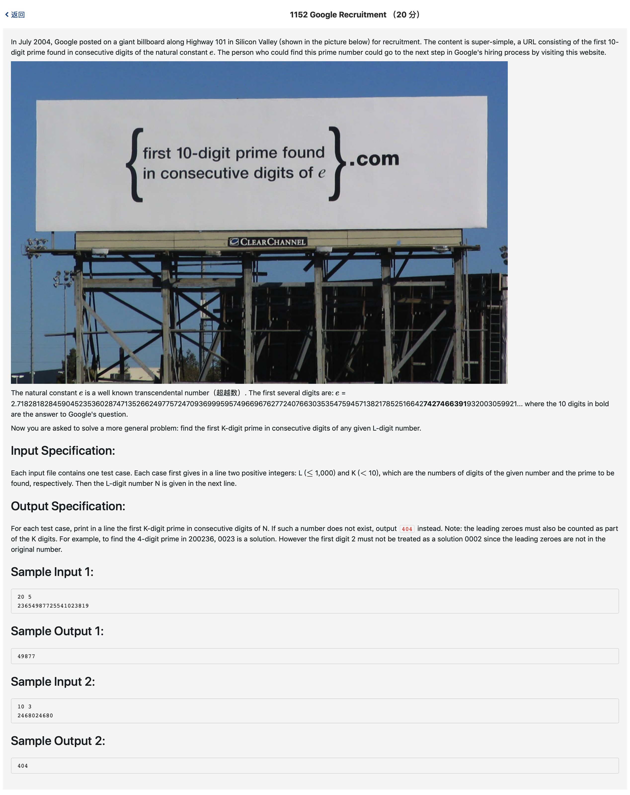

# 1152 Google Recruitment （20 分)



题解: 暴力搜索。

```c++
#include <iostream>
#include <math.h>
#include <string>
#include <map>
using namespace std;

char num[1100];
int L, n;


bool isPrime(long int num) {
    switch (num)
    {
        case 1: return false;
        case 2: return true;
        default: {
            for(int i = 2; i <= sqrt(num); ++i) {
                if(num % i == 0) {
                    return false;
                }
            }
        }
    }
    return true;
}

long int str2num(string s) {
    string :: iterator it;
    it = s.begin();
    long int res  = 0;
    while(it != s.end()) {
        res = res*10 + *it - '0';
        it++;
    }
    return res;
}

int main() {
    cin >> L >> n;
    char c;
    int idx = 0;
    getchar();
    while((c = getchar()) != '\n') {
        num[idx] = c;
        idx ++;
    }
    bool find = 0;
    for(int i = 0; i < L - n + 1; ++i) {
        string tmp;
        for(int j = i; j < i + n; ++j) {
            tmp += num[j];
        }
        long int cnum = str2num(tmp);
        if(isPrime(cnum)) {
            find = 1;
            cout << tmp << endl;
            break;
        } 
    }
    if(!find) {
        cout << 404 << endl;
    }

}
```