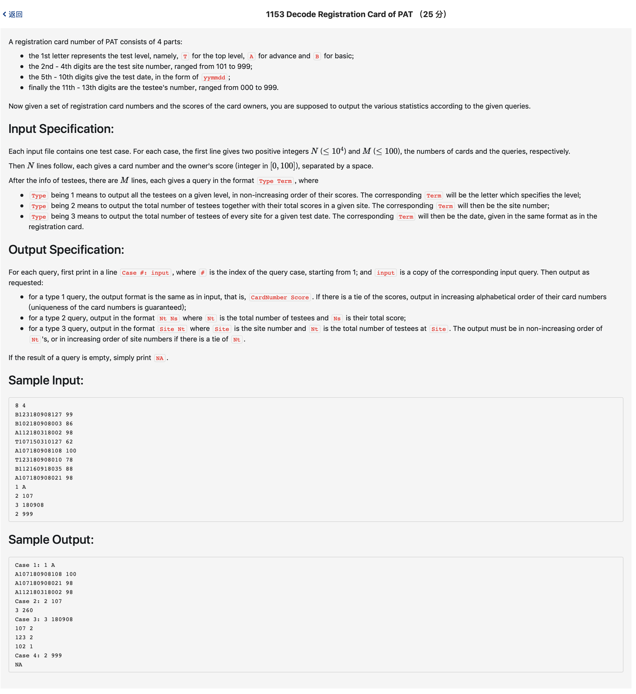

# 1153 Decode Registration Card of PAT （25 分)



题解: 比较复杂的字符串处理，用了合适的数据结构，再仔细一点就可以通过，没有什么特殊情况。

```c++
#include <iostream>
#include <map>
#include <vector>
#include <algorithm>
using namespace std;
typedef struct info {
    string card;
    int score;
} info;

typedef struct co {
    int idx;
    int count;
}co;

typedef vector <co> vco;

vector <info> infomation;
map <string, vco> timemap;
int sumscore[1000];
int sumcount[1000];
int n, m;

bool cmp(info a, info b) {
    if(a.score > b.score) {
        return true;
    } else if (a.score == b.score) {
        return a.card < b.card;
    } else {
        return false;
    }
}


bool choiceOne(char c) {
    vector <info> :: iterator it = infomation.begin();
    int flag = false;
    while(it != infomation.end()) {
        if(it->card[0] == c) {
            flag = true;
            printf("%s %d\n", it->card.data(), it->score);
        }
        it++;
    }
    return flag;
}

bool choiceTwo(int num) {
    if(sumcount[num] > 0) {
        printf("%d %d\n", sumcount[num], sumscore[num]);
        return true;
    } else {
        return false;
    }
}

bool cmp2(co a, co b) {
    if(a.count > b.count) {
        return true;
    } else if (a.count == b.count) {
        return a.idx < b.idx;
    } else {
        return false;
    }
}


bool choiceThree(string ti) {
    map <string, vco> :: iterator it = timemap.find(ti);
    if(it == timemap.end()) {
        return false;
    } else {
        sort(it->second.begin(), it->second.end(), cmp2);
        vector <co> :: iterator vit = it->second.begin();
        while(vit != it->second.end()) {
            printf("%d %d\n", vit->idx, vit->count);
            vit++;
        }
    }
    return true;
}


void printmap() {
    map <string, vco> :: iterator it = timemap.begin();
    while(it != timemap.end()) {
        cout << it->first << endl;
        for(int i = 0; i < it->second.size(); ++i) {
            cout << it->second[i].idx << ' ' << it->second[i].count << endl;
        }
        it++;
    }
}

int main() {
    cin >> n >> m;
    getchar();
    for(int i = 0; i < n; ++i) {
        char buff[1024];
        int tscore;
        scanf("%s %d", buff, &tscore);
        string tmp = buff;
        int testSiteNumber = atoi(tmp.substr(1, 3).data());
        sumscore[testSiteNumber] += tscore;
        sumcount[testSiteNumber] += 1;
        info tmpinfo;
        tmpinfo.card = tmp;
        tmpinfo.score = tscore;
        infomation.push_back(tmpinfo);

        string ti = tmp.substr(4, 6);
        map <string, vco> :: iterator mit = timemap.find(ti);
        int index = atoi(tmp.substr(1, 3).data());
        if(mit == timemap.end()) {
            vco vtmp;
            co ctmp;
            
            ctmp.idx = index;
            ctmp.count = 1;
            vtmp.push_back(ctmp);
            timemap.insert(make_pair(ti, vtmp));
        } else {
            int insertflag = 0;
            for(int k = 0; k < mit->second.size(); ++k) {
                if(mit->second[k].idx == index) {
                    mit->second[k].count += 1;
                    insertflag = 1;
                    break;
                }
            }
            if(!insertflag) {
                co ctmp;
                ctmp.idx = index;
                ctmp.count = 1;
                mit->second.push_back(ctmp);
            }
        }
    }
    sort(infomation.begin(), infomation.end(), cmp);
    for(int i = 0; i < m; ++i) {
        int testnum;
        scanf("%d", &testnum);
        getchar();
        bool find;
        switch (testnum)
        {
            case 1: {
                char c;
                scanf("%c", &c);
                printf("Case %d: %d %c\n", i + 1, testnum, c);
                find = choiceOne(c);
            }break;
            case 2: {
                int nums;
                scanf("%d", &nums);
                printf("Case %d: %d %d\n", i + 1, testnum, nums);
                find = choiceTwo(nums);
            }break;
            case 3: {
                char buff[128];
                scanf("%s", buff);
                printf("Case %d: %d %s\n", i + 1, testnum, buff);
                string tmp = buff;
                find = choiceThree(tmp);
            }break;
            default: {
                char buff[128];
                scanf("%s", buff);
                printf("Case %d: %d %s\n", i + 1, testnum, buff);
                find = false;
            }
        }
        if(!find) {
            printf("NA\n");
        }
    }
}


```

