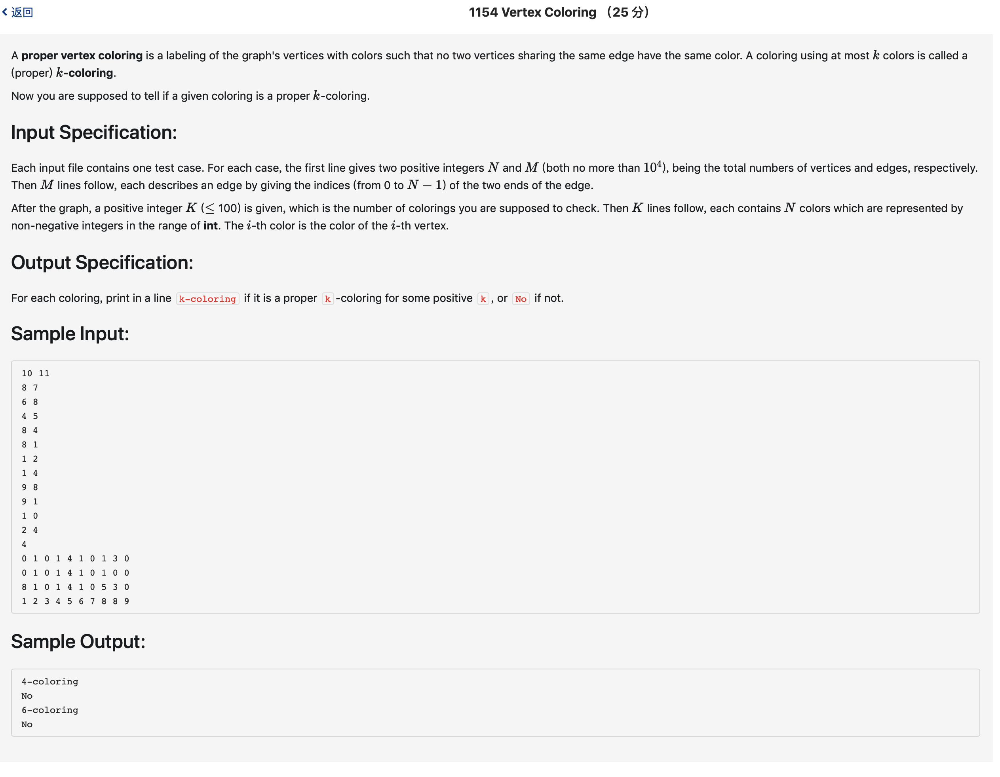

# 1154 Vertex Coloring （25 分)




题解: 仍然是遍历所有的点，如果发现相邻的点同色，则错误；否则记录颜色数量即可。

```c++

#include <iostream>
#include <algorithm>
#include <string>
#include <vector>
#include <map>
using namespace std;

int n, m;

vector <int> ma[100001];
int colorma[100001];
// int color[110];
map <int, int> color;

int main() {
    cin >> n >> m;
    for(int i = 0; i < m; ++i) {
        int a, b;
        cin >> a >> b;
        ma[a].push_back(b);
        ma[b].push_back(a);
    }
    int testnum;
    cin >> testnum;
    for(int i = 0; i < testnum; ++i) {
        int k_color = 0;
        color.clear();
        for(int j = 0; j < n; ++j) {
            colorma[j] = -1;
        }
        for(int j = 0; j < n; ++j) {
            int tmp;
            cin >> tmp;
            colorma[j] = tmp;
            map <int, int> :: iterator it = color.find(tmp);
            if(it == color.end()) {
                color.insert(make_pair(tmp, 0));
                k_color++;
            }
        }
        bool ok = 1;
        for(int j = 0; j < n; ++j) {
            for(int k = 0; k < ma[j].size(); ++k) {
                int b = ma[j][k];
                if(colorma[j] == colorma[b]) {
                    ok = 0;
                    break;
                }
            }
            if(!ok) {
                break;
            }
        }
        if(!ok) {
            printf("No\n");
        } else {
            printf("%d-coloring\n", k_color);
        }
    }
}
```