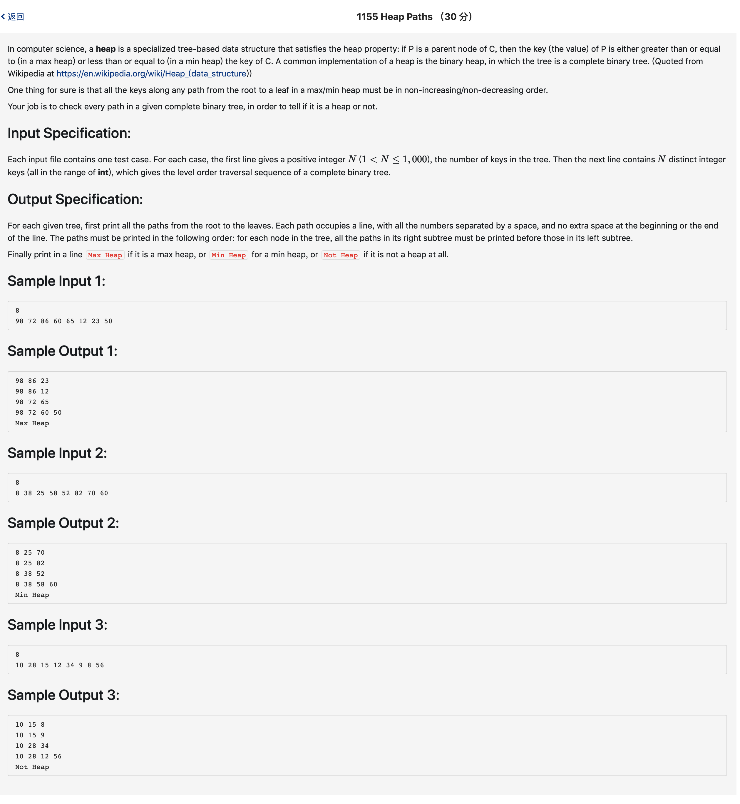

# 1155 Heap Paths （30 分)



题解:深度搜索加判断最大还是最小堆，本题代码用的判断方法不是最优的方法，应该在遍历的时候就去判断。

```c++
#include <iostream>
#include <vector>
#include <algorithm>
using namespace std;

int Tree[3001];
vector <int> path;
int n;
int flag = 0;
int nots = 0;
int getleft(int node) {
    return 2*node;
}
int getright(int node) {
    return 2*node + 1;
}

int cmp1 (int a, int b) {
    return a > b;
}

int cmp2 (int a, int b) {
    return a < b;
}


void dfs(int node, int depth) {
    int left = getleft(node);
    int right = getright(node);
    path.push_back(Tree[node]);
    
    if(Tree[right] != -1) {
        dfs(right, depth + 1);
    }
    if(Tree[left] != -1) {
        dfs(left, depth + 1);
    } 
    if(Tree[left] == -1 && Tree[right] == -1) {
        int ft = 0;
        vector <int> tmp;
        printf("%d", path[0]);
        tmp.push_back(path[0]);
        for(int i = 1; i < path.size(); ++i) {
            tmp.push_back(path[i]);
            printf(" %d", path[i]);
        }
        putchar('\n');
        //判断最大堆还是最小堆
        sort(tmp.begin(), tmp.end(), cmp1);
        for(int i = 0; i < tmp.size(); ++i) {
            if(tmp[i] == path[i]) {
                ft = 1;
            } else {
                ft = 0;
                break;
            }
        }
        if(flag == 0 && ft == 1) {
            flag = ft;
        }
        if(!ft) {
            sort(tmp.begin(), tmp.end(), cmp2);
            for(int i = 0; i < tmp.size(); ++i) {
                if(tmp[i] == path[i]) {
                    ft = -1;
                } else {
                    ft = 0;
                    break;
                }
            }
            if(flag == 0 && ft == -1) {
                flag = ft;
            }
        }
        if(!ft) {
            nots = 1;
        }
        if(flag != ft) {
            nots = 1;
        }
    }
    path.pop_back();
}

int main() {
    cin >> n;
    for(int i = 1; i <= 3000; ++i) {
        Tree[i] = -1;
    }
    for(int i = 1; i <= n; ++i) {
        scanf("%d", &Tree[i]);
    }
    dfs(1, 1);
    if(!nots) {
        if(flag == 1) {
            printf("Max Heap\n");
        } else if (flag == -1) {
            printf("Min Heap\n");
        }
    } else {
        printf("Not Heap\n");
    }
}
```
